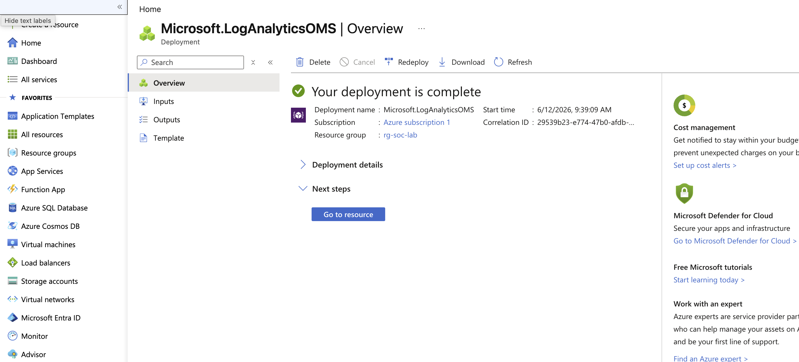
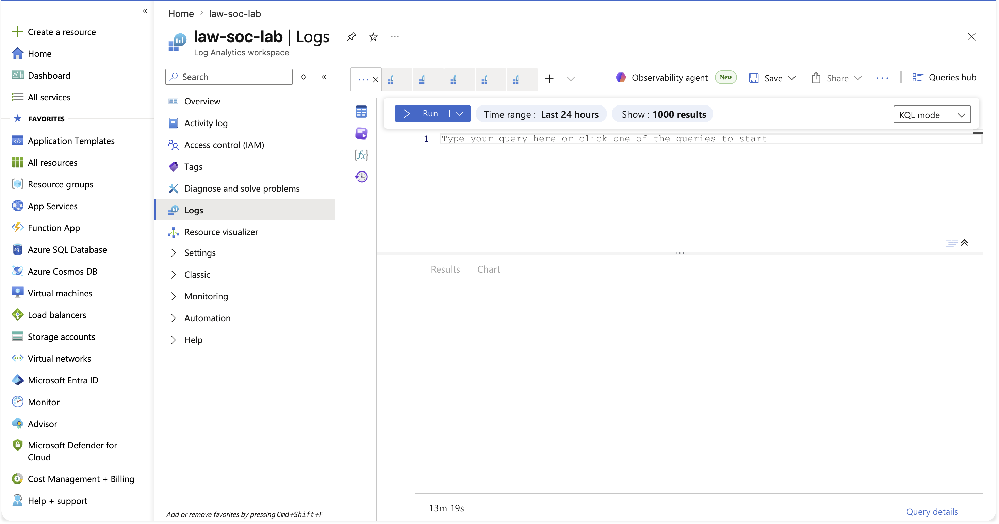
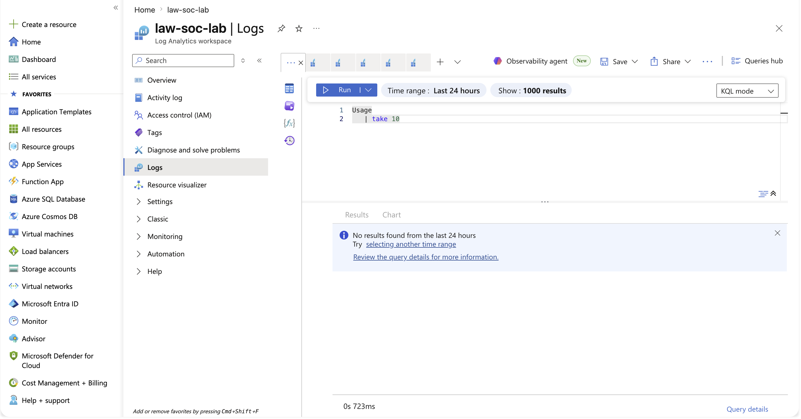
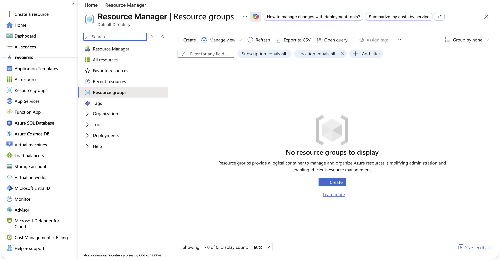
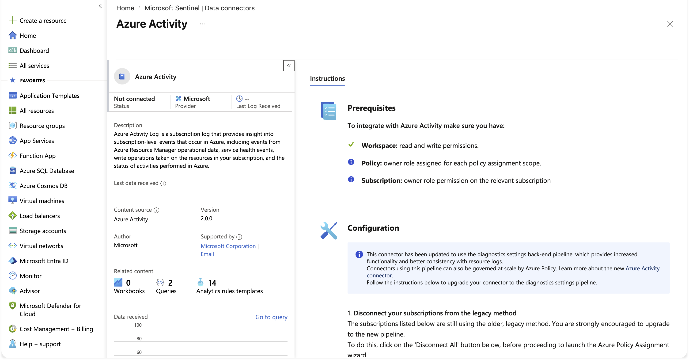
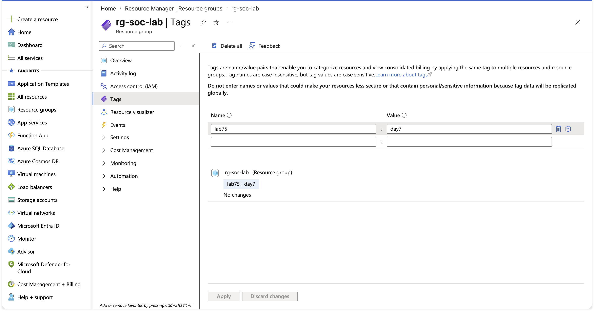
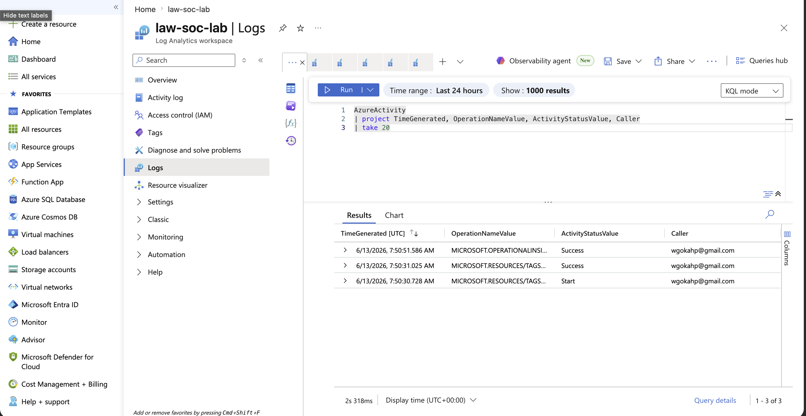
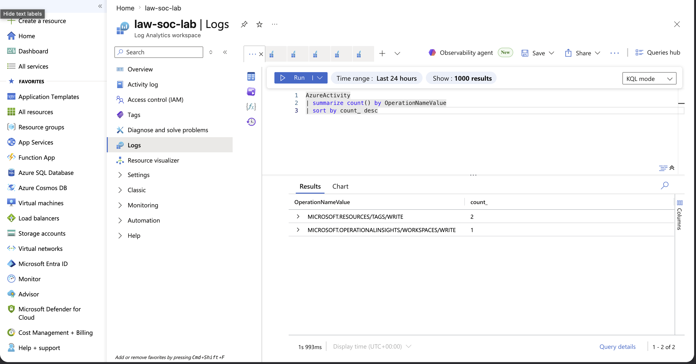
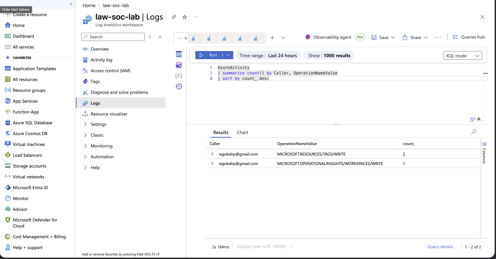
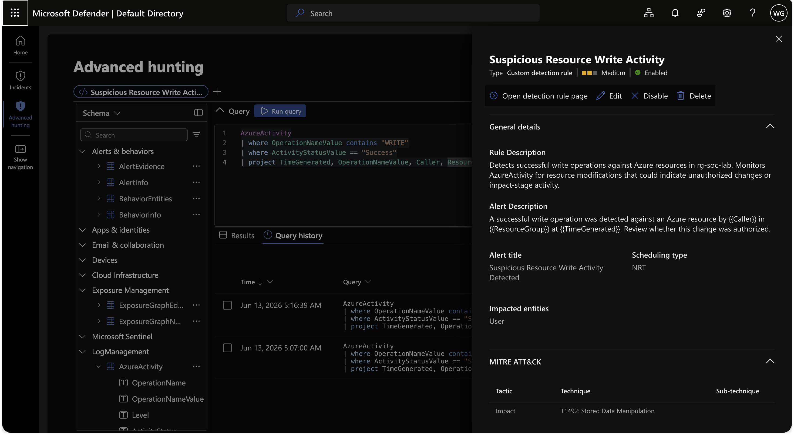

# Microsoft Sentinel SOC Lab Setup

## Incident / Lab Summary
This project documents the deployment of a Microsoft Sentinel cloud SIEM on Microsoft Azure, built as the foundation for hands-on SOC detection lab. Day 1 covers the full infrastructure build subscription, resource group, Log Analytics workspace, and Microsoft Sentinel followed by capturing a clean pre-ingestion baseline of the environment before any log sources are connected.

The goal of Day 1 is not detection yet. It is to stand up a working, query-ready SIEM and to record exactly what the environment looks like while it is empty, so that any future telemetry, alerts, and anomalies can be measured against a known-good starting point.

## Executive Summary
A Microsoft Sentinel workspace was provisioned on Azure using a free subscription. All resources were organised inside a single resource group for clean management and teardown. A Log Analytics workspace was deployed as the underlying data platform, and Microsoft Sentinel was layered on top to provide SIEM and SOAR capability. Before connecting any data connectors, the workspace was validated as empty and the baseline state was recorded using the Logs (KQL) editor. The environment is now ready for data source onboarding in Day 2.

## Architecture
\`\`\`
Azure Subscription
│
└── Resource Group: rg-soc-lab
    └── Log Analytics Workspace: law-soc-lab
        └── Microsoft Sentinel (SIEM / SOAR layer)
\`\`\`

- **Azure Subscription** the billing and management boundary. Without an active subscription, no resources can be created.
- **Resource Group (`rg-soc-lab`)** a logical container that holds every resource in this lab. Deleting the group removes everything inside it in a single action, which keeps the environment clean and prevents stray costs.
- **Log Analytics Workspace (`law-soc-lab`)** the data platform. This is where all logs are stored, indexed, and made queryable with KQL (Kusto Query Language). Sentinel does not store data itself; it reads from this workspace.
- **Microsoft Sentinel** the SIEM/SOAR layer that sits on top of the Log Analytics workspace. It provides detection rules, incidents, threat hunting, and investigation tooling. Sentinel is free to enable; cost is based only on the volume of data ingested into the workspace.

## Environment Details
| Component | Name | Region | Notes |
|-----------|------|--------|-------|
| Resource Group | rg-soc-lab | East US | Lab container for all resources |
| Log Analytics Workspace | law-soc-lab | East US | Data store, queried via KQL |
| Microsoft Sentinel | Attached to law-soc-lab | East US | SIEM/SOAR layer, 31-day free trial active |
| Subscription | Azure subscription 1 | — | Free tier, \$200 credit / 30 days |

## Build Methodology

### Step 1 Provision the Azure Subscription
A Microsoft Azure free account was created, providing a \$200 credit valid for 30 days plus a set of always-free services. The free-trial flow, including identity verification, is the step that actually provisions the subscription. Without a completed subscription, the directory exists but no resources can be deployed.

**SOC Observation:** A common Day 1 failure is an account with a directory but no subscription, shown by a "No subscriptions in this directory" message. The fix is to complete the full free-trial signup so the subscription provisions and attaches.

### Step 2 Create the Resource Group
A resource group named `rg-soc-lab` was created to act as the single container for all lab resources.


**SOC Observation:** Consistent naming (`rg-` prefix) and grouping all resources together is standard operational hygiene. It makes the environment easy to audit and easy to delete cleanly.

### Step 3 Deploy the Log Analytics Workspace
A Log Analytics workspace named `law-soc-lab` was deployed inside the resource group. This is the data lake that Sentinel reads from.



**SOC Observation:** The workspace must exist before Sentinel can be deployed, because Sentinel attaches to an existing workspace. Build order matters: data platform first, detection layer second.

### Step 4 Deploy Microsoft Sentinel
Microsoft Sentinel was deployed onto the `law-soc-lab` workspace, adding the SIEM/SOAR capability on top of the data platform.


**SOC Observation:** Enabling Sentinel is free; billing is driven only by data ingestion. A 31-day free trial was activated providing up to 10 GB/day free for both Sentinel and Log Analytics, which comfortably covers this lab.

### Step 5 Capture the Pre-Ingestion Baseline
Before connecting any data sources, the workspace was confirmed empty. The Logs interface reported "All tables are currently empty," and a baseline query was run in the Logs (KQL) editor to record the starting state.



Baseline query run in the Logs (KQL) editor:

\`\`\`kql
Usage
| take 10
\`\`\`



**SOC Observation:** You cannot identify abnormal activity without first recording what normal looks like. This empty-state snapshot is the reference point against which all future telemetry, in Day 2 onward, will be compared. Capturing a baseline before any change is a core SOC discipline used in threat hunting and detection tuning.

### Step 6 Confirm the Build
The Azure home view confirmed the environment was deployed and the free credit untouched, verifying the full Day 1 build succeeded.



## Tools Used
- Microsoft Azure (free subscription)
- Microsoft Sentinel (SIEM / SOAR)
- Azure Log Analytics (data platform)
- KQL (Kusto Query Language)

## Learning Outcomes
- Understood the relationship between Azure, Log Analytics, and Microsoft Sentinel (data platform vs detection layer).
- Provisioned cloud SIEM infrastructure from zero, in the correct build order.
- Learned why a resource group is used for clean management and teardown.
- Practised the baseline-first discipline: recording the known-good empty state before any ingestion.
- Diagnosed and resolved a real subscription-provisioning issue during setup.

## Conclusion
Day 1 delivered a fully deployed, query-ready Microsoft Sentinel SIEM on Azure with a documented pre-ingestion baseline. The environment is clean, organised in a single resource group, and ready for data source onboarding. Day 2 will connect the first data connector and validate live log ingestion against this baseline.


## Day 2 First Data Connector & Ingestion Validation

### Objective
Onboard the first telemetry source into Microsoft Sentinel and validate that log data is flowing into the workspace, measured against the Day 1 baseline.

### What I Did
- Reviewed the Sentinel data connectors gallery (8 connectors available)
- Opened the Azure Activity connector (status: Not connected)
- Connected Azure Activity using an Azure Policy assignment scoped to the subscription, streaming Activity logs into law-soc-lab
- Generated control-plane activity (resource group tag changes) to produce ingestable events
- Validated ingestion in the Logs (KQL) editor against the AzureActivity table

### Connector
| Connector | Data Type | Method | Cost | Status |
|-----------|-----------|--------|------|--------|
| Azure Activity | Subscription-level control-plane logs | Azure Policy (diagnostic settings pipeline) | Free | Connected |

### Build Steps

**1. Data connectors gallery**
Reviewed available connectors in Microsoft Sentinel for the law-soc-lab workspace.


**2. Azure Activity connector page**
Opened the Azure Activity connector, confirming prerequisites (workspace read/write, subscription owner) were met.



**3. Azure Policy assignment**
Assigned the "Configure Azure Activity logs to stream to specified Log Analytics workspace" policy, scoped to the subscription and pointing at law-soc-lab. Assignment succeeded.


**4. Generated activity**
Created resource group tag events to produce Azure Activity records for ingestion.



### SOC Observation
Azure Activity is connected via a diagnostic settings pipeline governed by Azure Policy. On first setup, ingestion is not instant the policy assignment, role assignment, and diagnostic setting must fully provision before any data flows, which can take from several minutes up to an hour. Querying immediately returns no results; this is expected pipeline latency, not a failure. The validation approach is to compare against the Day 1 empty baseline: once AzureActivity rows appear where the workspace was previously empty, ingestion is confirmed.

### Validation Query
```kql
AzureActivity
| take 20
```
Run in the Logs (KQL) editor with a time range covering the generated activity. The presence of AzureActivity rows where the Day 1 baseline showed an empty workspace confirms the data pipeline is live.

### Result
A verified telemetry pipeline feeding Microsoft Sentinel from the Azure subscription. The before/after against the Day 1 baseline demonstrates ingestion was proven, not assumed.


## Day 3 KQL Fundamentals

### Objective
Turn ingested logs into answers using KQL, the query language of Microsoft Sentinel. Run the core operators against the live AzureActivity data to filter, shape, and aggregate real telemetry.

### What I Did
- Sampled the raw AzureActivity table to see its structure
- Used project to cut dozens of columns down to the four that matter
- Used where to filter rows down to only the events of interest
- Used summarize to turn raw events into a ranked list of what happened
- Pivoted summarize by Caller to answer who did it

### The Funnel Model
KQL works like a funnel: start with the whole table, then narrow step by step until only the events that matter remain.

Table -> where (filter rows) -> project (pick columns) -> summarize (aggregate) -> sort (rank)

### Build Steps

**1. Raw table baseline**
Sampled the unfiltered table to see its shape and column count.


**2. project cut the columns**
Trimmed dozens of columns down to four: when, what, status, who.



**3. where filter the rows**
Kept only successful operations, filtering out the Start events.


**4. summarize what happened**
Collapsed every event into a ranked list of operations by count.



**5. summarize by Caller who did it**
Pivoted on Caller to attribute every action to an identity.



### SOC Observation
Azure logs many operations as a Start/Success pair, so counting raw events without accounting for this can double the numbers. The count column KQL generates is named count_ with a trailing underscore. where filters rows and project filters columns; they are chained filter-first, then shape. The by Caller pivot is the backbone of attribution and the basis for brute-force detection later.

### Core Operators
| Operator | What it does |
|----------|--------------|
| where | Keeps only rows matching a condition |
| project | Keeps only the columns you name |
| summarize | Groups rows and aggregates |
| sort | Orders results |
| count / take | Counts rows / samples N rows |

### Result
The ability to query a live SIEM with KQL filtering, shaping, aggregating, and attributing real telemetry. This is the core day-to-day skill of a Tier 1 SOC analyst.


## Day 4 Analytics Rule Lab: Scheduled Detection and Incident Triage

### Incident Summary
A custom detection rule named "Suspicious Resource Write Activity" was built in Microsoft Sentinel (via the unified Microsoft Defender portal) to detect successful write operations against Azure resources in rg-soc-lab. The rule was triggered by a controlled resource tag write, generating an incident that was triaged end to end as a SOC Tier 1 analyst.

### Executive Summary
Day 4 moved from interactive hunting (Day 3 KQL) to operational detection: converting a validated KQL query into a scheduled rule that runs automatically, raises alerts, correlates them into incidents, and surfaces them in the Incidents queue for triage. The detection logic, alert enrichment, entity mapping, and full incident lifecycle (assignment, status, classification) were exercised against live AzureActivity data.

### Affected System
- Log Analytics Workspace: law-soc-lab (Workspace ID e19a5dce-4777-4f66-9a27-2318c18a2f46)
- Resource Group: rg-soc-lab (East US)
- Data source: AzureActivity table
- Caller / impacted identity: wgokahp@gmail.com

### Investigation Methodology

Step 1 Validated the detection query in Logs, confirming successful WRITE events were returned with the required TimeGenerated column.


```kql
AzureActivity
| where OperationNameValue contains "WRITE"
| where ActivityStatusValue == "Success"
| project TimeGenerated, OperationNameValue, Caller, ResourceGroup
```

Step 2 Created a custom detection rule using the unified detection wizard. Configured the rule name, description, query, and frequency.


Step 3 Set severity, MITRE category and technique, and recommended analyst actions.


Step 4 Saved the rule. Confirmed Enabled status, Medium severity, NRT scheduling, and Impact / T1492 mapping.



Step 5 Triggered the rule by writing a tag (Day4 : rule-test) to rg-soc-lab, then triaged the resulting incident: took ownership, set status to In Progress, classified as a true positive, and applied the lab-test tag.


### Rule Configuration
| Setting | Value |
| --- | --- |
| Rule name | Suspicious Resource Write Activity |
| Type | Custom detection rule (Defender XDR / Sentinel unified) |
| Frequency | Continuous (NRT) |
| Lookback | None (NRT rules evaluate as events are ingested) |
| Severity | Medium |
| Entity mapping | User (Account) → UPN → Caller |
| Status | Enabled |

### IOCs
| Indicator | Type | Context |
| --- | --- | --- |
| wgokahp@gmail.com | Account (UPN) | Caller performing the write operation |
| MICROSOFT.RESOURCES/TAGS/WRITE | Operation | Resource tag modification |
| MICROSOFT.OPERATIONALINSIGHTS/WORKSPACES/WRITE | Operation | Workspace configuration write |
| rg-soc-lab | Resource group | Target of the write activity |

### MITRE ATT&CK
| Tactic | Technique | Sub-technique |
| --- | --- | --- |
| Impact (TA0040) | T1492: Stored Data Manipulation | — |

Note: T1492 is an approximate mapping. A resource/configuration write is a form of stored-data manipulation, but the activity (a tag write) is broad. The mapping is documented as approximate rather than forced to a more specific destructive technique.

### SOC Analyst Findings
- The rule fired correctly, raising two alerts that correlated into a single incident ("Suspicious Resource Write Activity Detected involving one user").
- Detection source: Custom detection. Product: Microsoft Defender XDR. Category: Impact.
- The impacted entity (User: wgokahp) was correctly identified via the UPN entity mapping, confirming the entity correlation worked as designed.
- Dynamic alert enrichment tokens ({{Caller}}, {{ResourceGroup}}, {{TimeGenerated}}) resolved from the projected query columns.

### SOC Analyst Response
- Assigned the incident to the analyst account (took ownership).
- Set incident status to In Progress.
- Classified the incident as a true positive (benign in context the write activity was authorized lab activity generated for detection testing).
- Applied the incident tag "lab-test" for documentation.
- No automated remediation was configured; triage was performed manually, which is the correct posture for a Tier 1 detection-and-triage exercise.

### Analyst Insight
Several platform behaviors differ from the legacy Sentinel scheduled-rule model and are worth noting for real-world work:
- The Analytics rule wizard has moved into the unified Defender portal as a "custom detection rule." The "Create analytics rule instead" link returns the legacy experience.
- The classic "frequency + lookback" pairing is replaced by a single frequency control. NRT rules carry no lookback period; daily-or-less rules apply an automatic 30-day look-back. This removes the old "lookback must be greater than or equal to frequency" trap.
- Entity correlation quality depends on choosing the identifier type that matches the data format. The Caller value is email-formatted, so UPN was the correct identifier not AadUserId (GUID) or SID.
- Alert enrichment pulls directly from the projected query columns, which is why projecting clean, useful columns in the detection query matters.

### Learning Outcome
Built and operated a complete detection lifecycle: query validation → scheduled rule → alert enrichment → entity mapping → incident generation → Tier 1 triage. Reinforced the distinction between hunting (interactive) and detection (automated), and documented the real-world differences between the legacy Sentinel rule wizard and the unified Defender XDR custom detection experience.

### Repository Structure
```
sentinel-soc-lab-setup/
├── README.md
└── screenshots/
    ├── day04-detection-query.png
    ├── day04-analytics-rule-logic-1.png
    ├── day04-analytics-rule-logic-2.png
    ├── day04-rule-created.png
    └── day04-incident-triaged.png
```

### Conclusion
Day 4 delivered a working scheduled detection rule that detects suspicious resource write activity, raises alerts, correlates them into incidents, and supports full manual triage completing the transition from ad hoc hunting to operational detection engineering in Microsoft Sentinel.

 
 
 

 
 
 
##Day 5 SOC Tier 1 Incident Report: SSH Brute-Force Detection & Compromise Confirmation

## Incident Summary

- **Incident Type:** Credential Access via SSH Brute-Force (Successful Compromise)
- **Severity:** High (Confirmed account compromise - valid credentials obtained)
- **Detection Method:** Threat hunt across Linux Syslog (auth/authpriv) in Microsoft Sentinel
- **Data Pipeline:** Ubuntu auth.log -> Azure Monitor Agent -> Data Collection Rule -> Sentinel (law-soc-lab)
- **Tools Used:** Hydra (attack), Azure Arc, Azure Monitor Agent, Microsoft Sentinel, KQL
- **Status:** Detected, confirmed, and contained

## Executive Summary

An automated SSH brute-force attack was launched from a single host against a monitored Linux server. The attacker targeted the local account "mary" with a rapid sequence of password guesses. Across the campaign, 88 failed authentication attempts and 8 successful logins originated from the same source IP, confirming a credential compromise rather than a blocked attack. The activity was detected by hunting the Linux Syslog auth facility ingested into Microsoft Sentinel, the compromise was confirmed by correlating failure and success counts per source, and the attacker was contained by blocking the source IP at the host firewall.

## Affected System

- **Target Host:** wazuh-manager (Ubuntu 24.04.4 LTS)
- **Target IP:** 192.168.64.12
- **Targeted Account:** mary
- **Exposed Service:** OpenSSH (TCP/22)
- **Monitoring:** Azure Monitor Agent forwarding auth/authpriv syslog to Sentinel workspace law-soc-lab

## Investigation Methodology

A baseline check of the identity sign-in logs was performed first. Querying SigninLogs returned no results, confirming that Entra-based authentication telemetry was not available in this environment and that the brute-force hunt would need to be conducted against host-level Linux authentication logs instead.


To bring host-level authentication telemetry into Microsoft Sentinel, the Linux target was onboarded to Azure Arc, registering the machine as a hybrid-connected resource in Azure.


The Azure Monitor Agent was then deployed to the Arc-connected machine, and a Data Collection Rule scoped to the auth and authpriv syslog facilities was associated with it. The agent was confirmed running on the target.


A baseline query verified that auth and authpriv syslog events were flowing into the Sentinel workspace before any attack was simulated.


A controlled brute-force attack was then executed from the attacker host using Hydra against the SSH service, cycling through a password list targeting the account "mary" and ending in a successful authentication.


The resulting authentication events were confirmed to have propagated into the Sentinel Syslog table, establishing that the hunt would operate on live ingested telemetry.


## Indicators of Compromise (IOCs)

| Indicator | Type | Value |
|---|---|---|
| Source IP | IPv4 | 192.168.64.15 |
| Targeted account | Username | mary |
| Target host | Hostname | wazuh-manager |
| Target service | Port | TCP/22 (SSH) |
| Failed authentications | Count | 88 |
| Successful authentications | Count | 8 |
| Attack window | Time range | ~3:28 AM - 3:30 AM UTC |

## MITRE ATT&CK Mapping

| Tactic | Technique | ID |
|---|---|---|
| Credential Access | Brute Force: Password Guessing | T1110.001 |
| Credential Access | Brute Force | T1110 |
| Initial Access | Valid Accounts | T1078 |

## SOC Analyst Findings

The first hunt query aggregated failed SSH authentications by source IP and targeted user, surfacing a single source (192.168.64.15) responsible for 88 failed login attempts against the account mary. This concentration of failures from one source against one account is the defining signature of a password-guessing brute-force.


The second query correlated failure and success counts per source IP. The same source IP showed 88 failures alongside 8 successful logins. The presence of successful authentications following a high volume of failures elevated this from an attempted attack to a confirmed compromise: the attacker obtained valid credentials and authenticated to the host.


The third query reconstructed the attack chronologically, tagging each event as FAILED or SUCCESS and ordering by time. The timeline visualization showed a dense burst of activity compressed into a window of roughly 75 seconds consistent with an automated tool rather than manual access while the detailed event table showed the sequence of failed attempts punctuated by successful logins, all from the attacker IP.


## SOC Analyst Response

Upon confirming the compromise, the attacker source IP was contained at the host firewall. A deny rule for 192.168.64.15 was inserted at the top of the UFW ruleset so that it is evaluated before the permissive SSH rule, cutting off all further access from the attacker.


Recommended follow-up actions for a production environment would include resetting the compromised account credentials, reviewing the account for any post-compromise activity (new sessions, privilege changes, persistence), and enforcing preventative controls such as key-based authentication, fail2ban, and SSH access restricted to trusted source ranges.

## Analyst Insight

The decisive analytical step was not detecting failed logins in isolation but correlating failures with successes from the same source. A high failure count alone indicates an attempted attack that may have been repelled; a high failure count paired with one or more successes indicates the attacker broke through. This distinction is what separates routine noise from an escalation-worthy incident, and it is the judgment a Tier 1 analyst must apply before raising a confirmed compromise.

## Learning Outcome

This investigation exercised the full incident lifecycle on a self-built telemetry pipeline: onboarding a Linux host to Azure Arc, deploying the Azure Monitor Agent, scoping a Data Collection Rule to the auth and authpriv syslog facilities, and hunting the resulting data in Microsoft Sentinel with KQL. It reinforced parsing unstructured syslog with regex extraction, correlating events across a join to confirm compromise, reconstructing an attack timeline, and closing the loop with a containment action the detect, confirm, contain sequence that defines Tier 1 SOC work.

## Repository Structure

```
sentinel-soc-lab-setup/
├── README.md
└── screenshots/
    ├── day05-auth-baseline.png
    ├── day05-arc-connected.png
    ├── day05-ama-extension.png
    ├── day05-syslog-baseline.png
    ├── day05-attack-execution.png
    ├── day05-syslog-attack-confirmed.png
    ├── day05-failure-spike.png
    ├── day05-compromise-found.png
    ├── day05.a-attack-timeline.png
    ├── day05.b-attack-timeline.png
    └── day05-containment-block.png
```

## Conclusion

A simulated SSH brute-force against a monitored Linux host was detected, confirmed as a successful compromise, and contained using a Sentinel-based detection pipeline built from the ground up. By correlating 88 failed and 8 successful authentications from a single source IP, the investigation moved beyond surface-level alerting to a confirmed-breach determination, then closed with a firewall containment action demonstrating the end-to-end detection and response workflow expected of a SOC Tier 1 analyst.
