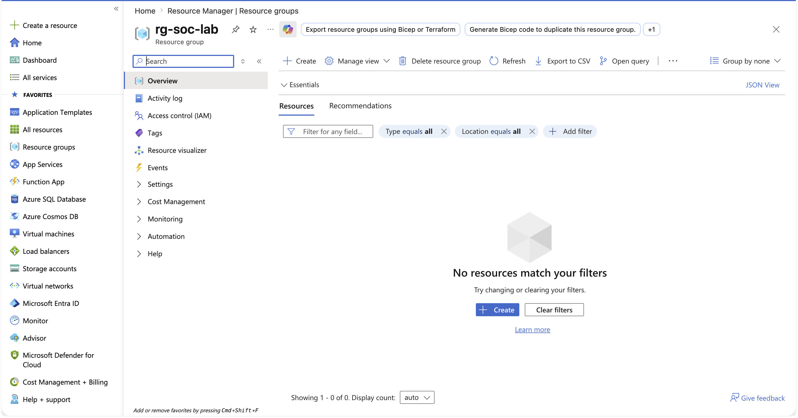
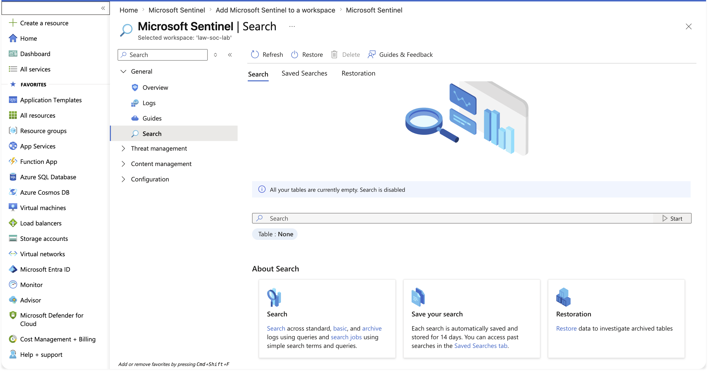

# Day 1 Workspace Deployment & Baseline

## Incident Summary
Stood up the foundation of the SOC environment: deployed a Log Analytics workspace, enabled Microsoft Sentinel, and captured a clean baseline confirming the workspace was empty before any telemetry was onboarded.

## Objective
Establish the central telemetry destination and prove, with evidence, that the environment starts from a known-empty state the evidentiary foundation for every later before/after validation.

## Affected System
- Log Analytics Workspace: law-soc-lab (Workspace ID e19a5dce-4777-4f66-9a27-2318c18a2f46)
- Resource Group: rg-soc-lab (East US)
- Platform: Microsoft Sentinel

## Investigation Methodology

Created the resource group that contains all lab resources.

Deployed the Log Analytics workspace that serves as the central telemetry store.

Enabled Microsoft Sentinel on the workspace.

Reviewed the deployed resources in the portal.

Ran a baseline query confirming the workspace tables were empty prior to onboarding.

## SOC Observation
Capturing an empty baseline is not a formality it is the reference point that lets every later ingestion be proven rather than assumed. When data later appears where the baseline showed none, ingestion is confirmed.

## Learning Outcome
Deployed a Microsoft Sentinel workspace from scratch and established a documented empty baseline, the foundation for evidence-based ingestion validation throughout the lab.

## Next
Day 2: connect the first data source and validate ingestion against this baseline.
