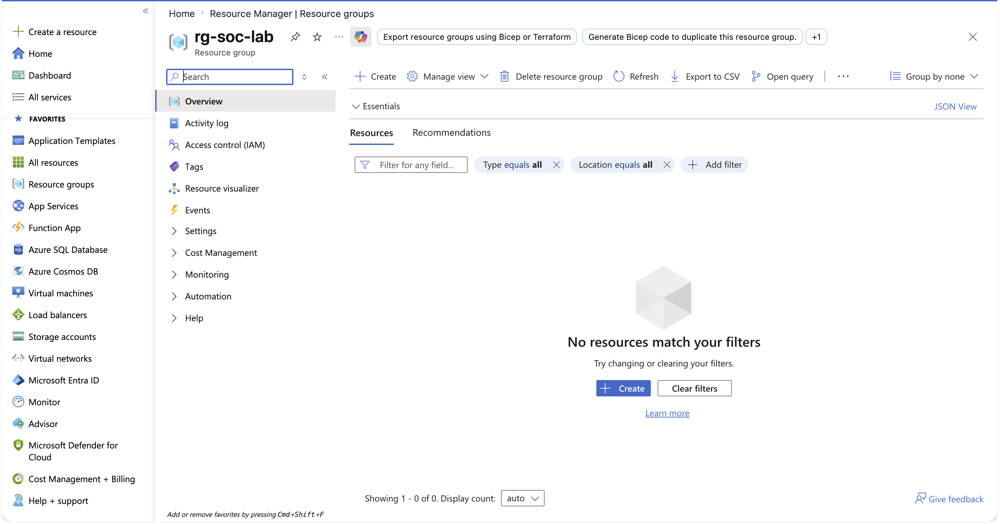
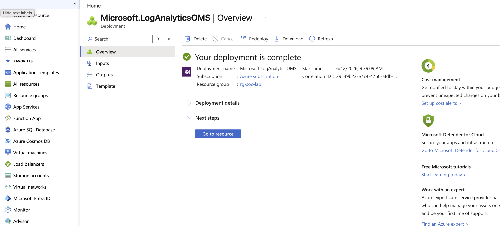
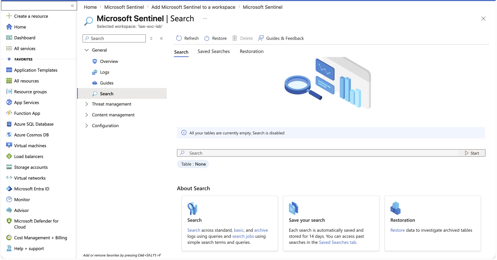
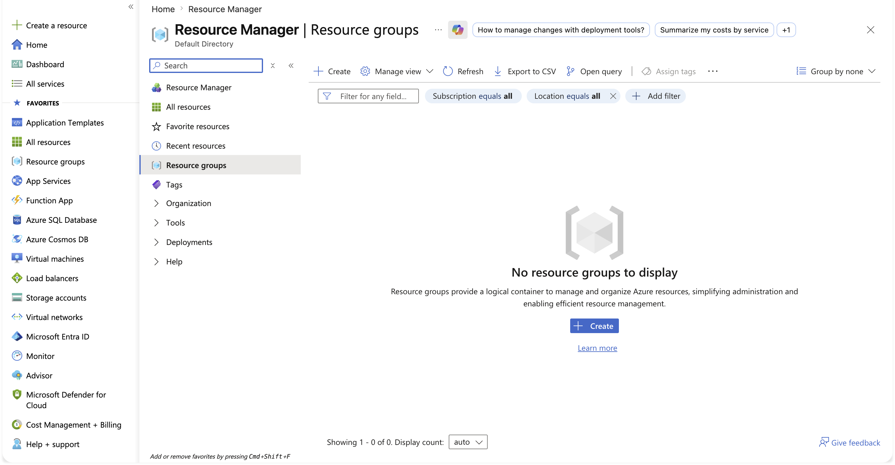
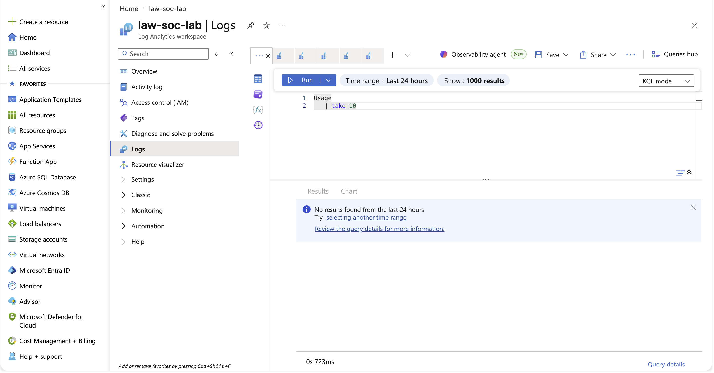
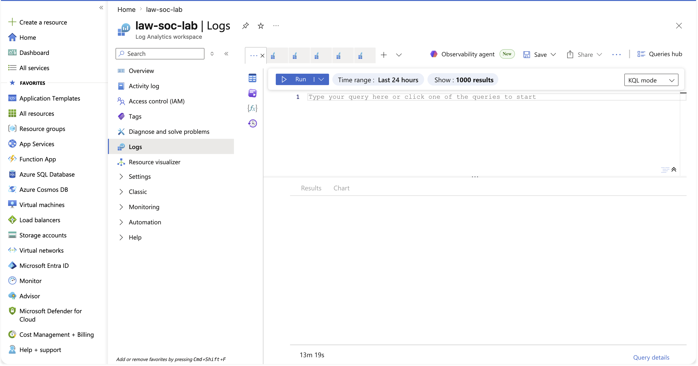

# Day 1 — Workspace Deployment & Baseline

Every later "ingestion confirmed" claim in this lab rests on one thing proven here: that the workspace started empty. This day deploys the Sentinel foundation and captures the empty baseline that turns every subsequent detection from an assumption into evidence.

## At a Glance

| Field | Detail |
| --- | --- |
| Stage | Day 1 of 7, foundation |
| Goal | Deploy Sentinel, capture empty baseline |
| Workspace | law-soc-lab (ID e19a5dce-4777-4f66-9a27-2318c18a2f46) |
| Resource Group | rg-soc-lab, East US |
| Platform | Microsoft Sentinel |
| Output | Documented known-empty starting state |

## What This Is

The foundation of the SOC environment: a Log Analytics workspace deployed, Microsoft Sentinel enabled on it, and a clean baseline captured confirming the workspace was empty before any telemetry was onboarded.

The objective is to establish the central telemetry destination and prove, with evidence, that the environment starts from a known-empty state, the evidentiary foundation for every later before/after validation in the lab.

## Affected System

- Log Analytics Workspace: `law-soc-lab` (Workspace ID `e19a5dce-4777-4f66-9a27-2318c18a2f46`)
- Resource Group: `rg-soc-lab` (East US)
- Platform: Microsoft Sentinel

## Investigation Methodology

Created the resource group that contains all lab resources.

Deployed the Log Analytics workspace that serves as the central telemetry store.

Enabled Microsoft Sentinel on the workspace.

Reviewed the deployed resources in the portal.

Ran a baseline query confirming the workspace tables were empty prior to onboarding.

## SOC Observation

Capturing an empty baseline is not a formality, it is the reference point that lets every later ingestion be proven rather than assumed. When data later appears where the baseline showed none, ingestion is confirmed rather than hoped for. Skipping this step is how an analyst ends up unable to tell the difference between a working pipeline and a quiet attacker.

## Learning Outcome

Deployed a Microsoft Sentinel workspace from scratch and established a documented empty baseline, the foundation for evidence-based ingestion validation throughout the lab.

## Next

Day 2: connect the first data source and validate ingestion against this baseline.
