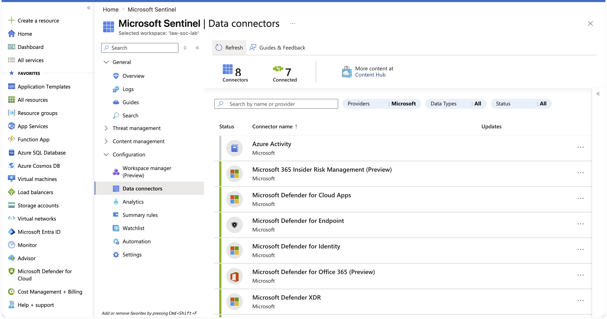
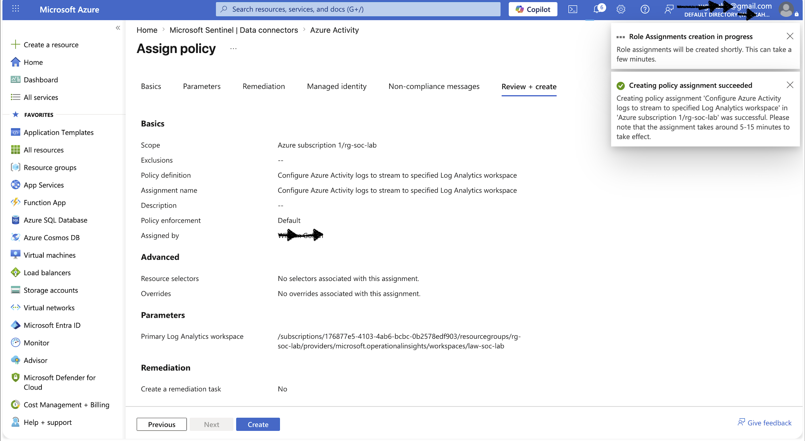
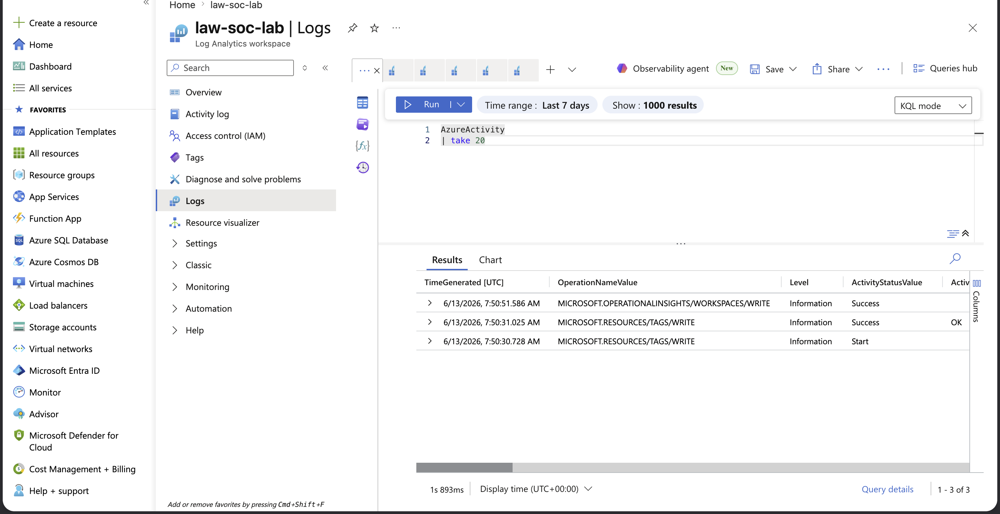

# Day 2 First Data Connector & Ingestion Validation

## Incident Summary
Onboarded the first telemetry source into Microsoft Sentinel via the Azure Activity connector, then validated end to end that log data flowed into the workspace by generating control-plane events and confirming them in KQL against the Day 1 baseline.

## Objective
Prove a working ingestion pipeline not just a connected connector, but data actually arriving and queryable.

## Affected System
- Log Analytics Workspace: law-soc-lab
- Data source: Azure Activity (subscription control-plane logs)

## Investigation Methodology

Reviewed the Sentinel data connectors gallery.



Opened the Azure Activity connector page and confirmed prerequisites.


Assigned the Azure Policy to stream Activity logs to law-soc-lab. Assignment succeeded.



Generated control-plane activity (resource-group tag changes) to produce ingestable events.


Validated ingestion in the Logs editor AzureActivity rows appeared where the Day 1 baseline was empty.



## SOC Observation
The Azure Policy assignment reported success but did not, on its own, create the diagnostic setting that actually streams data. A diagnostic setting had to be created manually before any data flowed. The lesson: a green checkmark is not proof of ingestion validate with a query. First-time ingestion can also take from several minutes up to an hour to appear; an immediate empty result is expected latency, not failure.

## Validation Query
```kql
AzureActivity
| take 20
```

## Learning Outcome
Connected and validated a real telemetry pipeline, proving ingestion against the Day 1 baseline and learning to distinguish "configured" from "actually working."

## Next
Day 3: turn ingested logs into detection queries with KQL.
