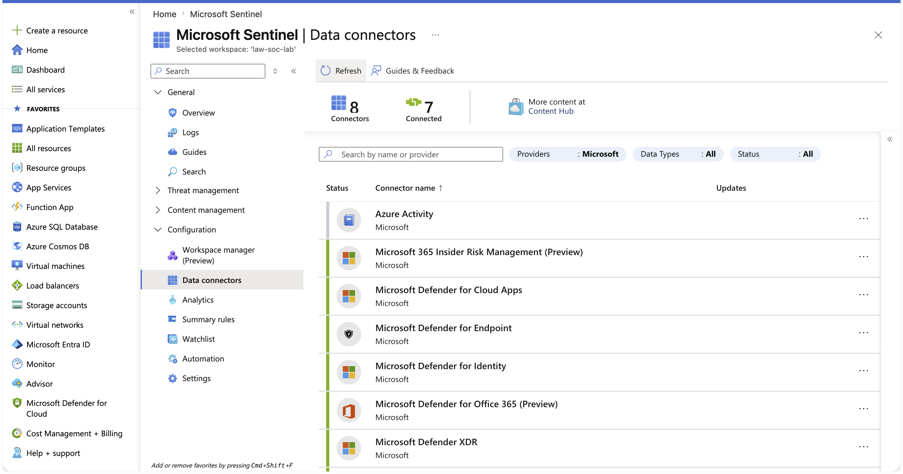
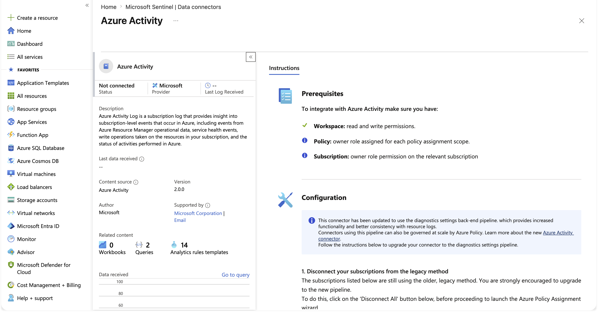
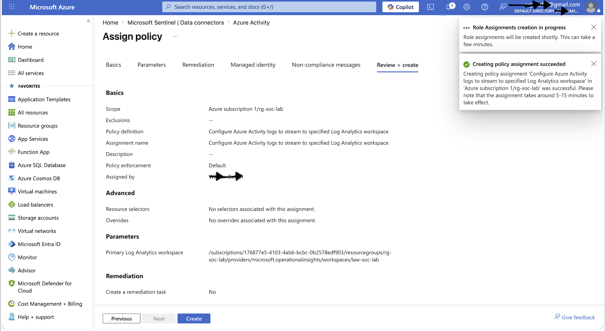
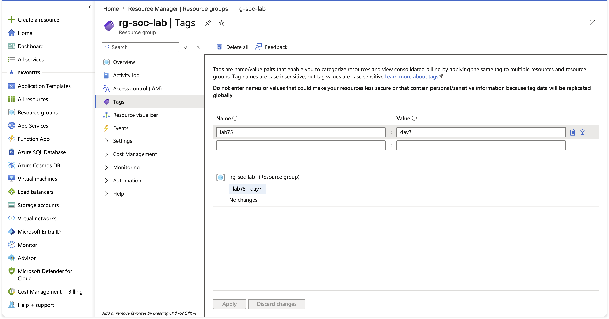
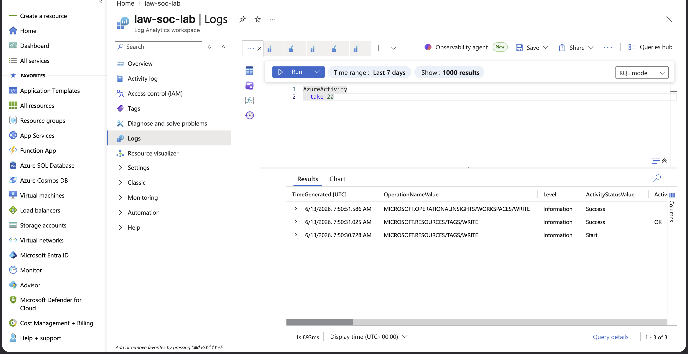

# First Data Connector & Ingestion Validation

A policy assignment reported success, and no data flowed anyway. This day onboards the first telemetry source into Sentinel and proves the difference between a connector that says "connected" and a pipeline that actually delivers queryable logs, the gap where most ingestion failures hide.

## At a Glance

| Field | Detail |
| --- | --- |
| Stage | Day 2 of 7, ingestion |
| Goal | Prove data arrives and is queryable, not just connected |
| Workspace | law-soc-lab |
| Data source | Azure Activity (subscription control-plane logs) |
| Key Gotcha | Policy assignment succeeded but streamed nothing until a diagnostic setting was added manually |
| Validation | AzureActivity rows confirmed against the Day 1 empty baseline |

## What This Is

The first telemetry source onboarded into Microsoft Sentinel, via the Azure Activity connector, then validated end to end: control-plane events were generated and confirmed in KQL against the Day 1 baseline.

The objective is to prove a working ingestion pipeline, not just a connected connector, but data actually arriving and queryable. That distinction is the entire point of the day.

## Affected System

- Log Analytics Workspace: `law-soc-lab`
- Data source: Azure Activity (subscription control-plane logs)

## Investigation Methodology

Reviewed the Sentinel data connectors gallery.



Opened the Azure Activity connector page and confirmed prerequisites.



Assigned the Azure Policy to stream Activity logs to `law-soc-lab`. Assignment succeeded.



Generated control-plane activity (resource-group tag changes) to produce ingestable events.



Validated ingestion in the Logs editor, AzureActivity rows appeared where the Day 1 baseline was empty.



## SOC Observation

The Azure Policy assignment reported success but did not, on its own, create the diagnostic setting that actually streams data. A diagnostic setting had to be created manually before any data flowed.

The lesson is the one that matters most in detection engineering: a green checkmark is not proof of ingestion, validate with a query. A connector's own status page reports its configuration, not its output, and the two diverge constantly in production. The only proof that a pipeline works is data appearing where the baseline showed none.

First-time ingestion can also take from several minutes up to an hour to appear; an immediate empty result is expected latency, not failure. Knowing that difference is what stops an analyst from "fixing" a pipeline that was never broken.

## Validation Query

```kql
AzureActivity
| take 20
```

## Learning Outcome

Connected and validated a real telemetry pipeline, proving ingestion against the Day 1 baseline and learning to distinguish "configured" from "actually working."

## Next

Day 3: turn ingested logs into detection queries with KQL.
