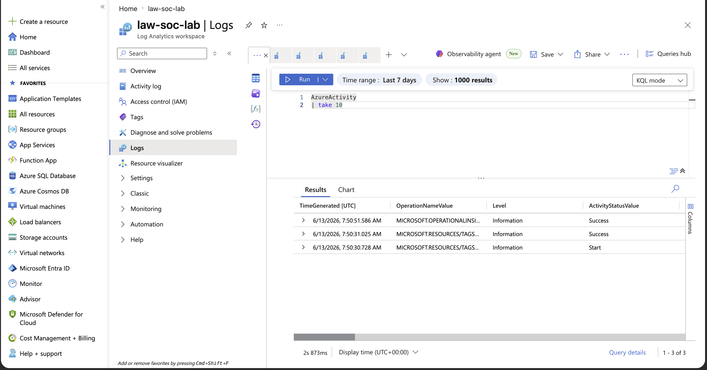
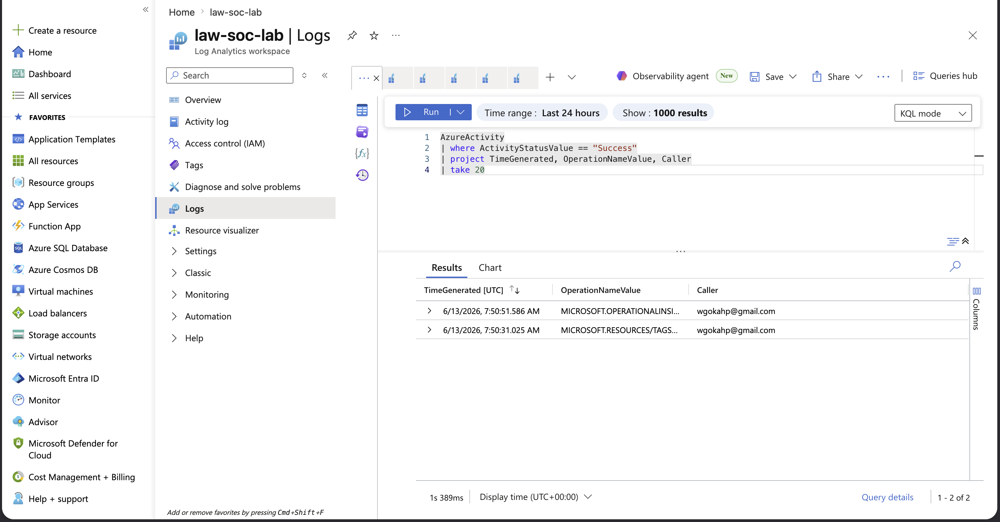

# Day 3 — KQL Fundamentals

## Incident Summary
Turned ingested logs into answers using KQL, running the core operators against the live AzureActivity data to filter, shape, aggregate, and attribute real telemetry.

## Objective
Build query fluency — the day-to-day skill of a SOC analyst — using real ingested events rather than textbook samples.

## The Funnel Model
KQL works like a funnel: start with the whole table, then narrow step by step until only the events that matter remain.

`Table -> where (filter rows) -> project (pick columns) -> summarize (aggregate) -> sort (rank)`

## Investigation Methodology

Sampled the raw table to see its shape and column count.

Used project to cut dozens of columns down to four: when, what, status, who.

Used where to keep only successful operations, filtering out Start events.

Used summarize to collapse every event into a ranked list of operations by count.

Pivoted summarize by Caller to attribute every action to an identity.

## SOC Observation
Azure logs many operations as a Start/Success pair, so counting raw events without accounting for this can double the numbers. The auto-generated count column is named `count_` with a trailing underscore. `where` filters rows and `project` filters columns; they are chained filter-first, then shape. The `by Caller` pivot is the backbone of attribution and the basis for brute-force detection later.

## Core Operators
| Operator | What it does |
|----------|--------------|
| where | Keeps only rows matching a condition |
| project | Keeps only the columns you name |
| summarize | Groups rows and aggregates |
| sort | Orders results |
| count / take | Counts rows / samples N rows |

## Learning Outcome
Demonstrated the ability to query a live SIEM with KQL — filtering, shaping, aggregating, and attributing real telemetry.

## Next
Day 4: turn these queries into a scheduled detection that fires incidents automatically.
