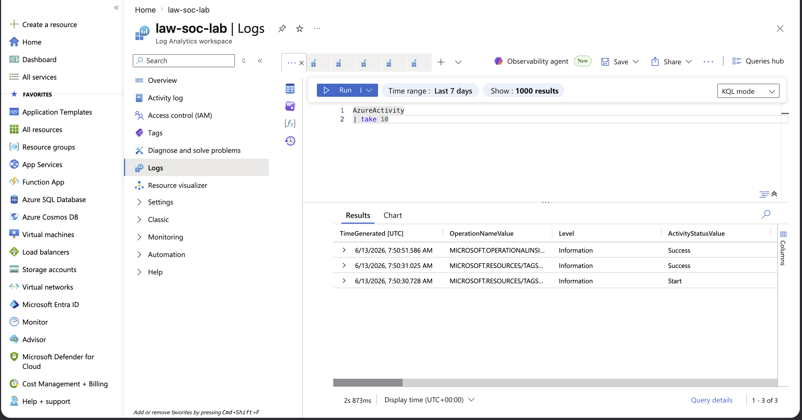
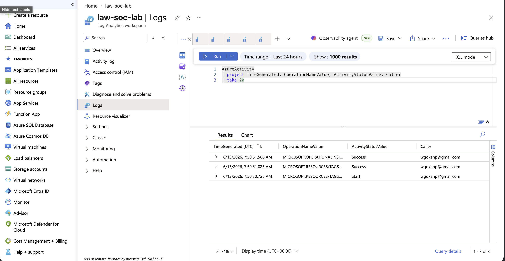
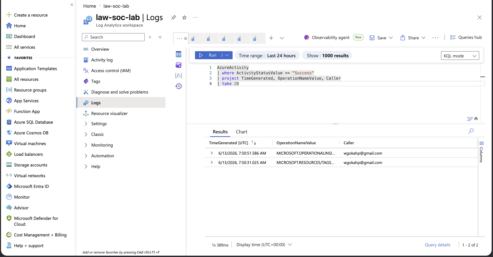
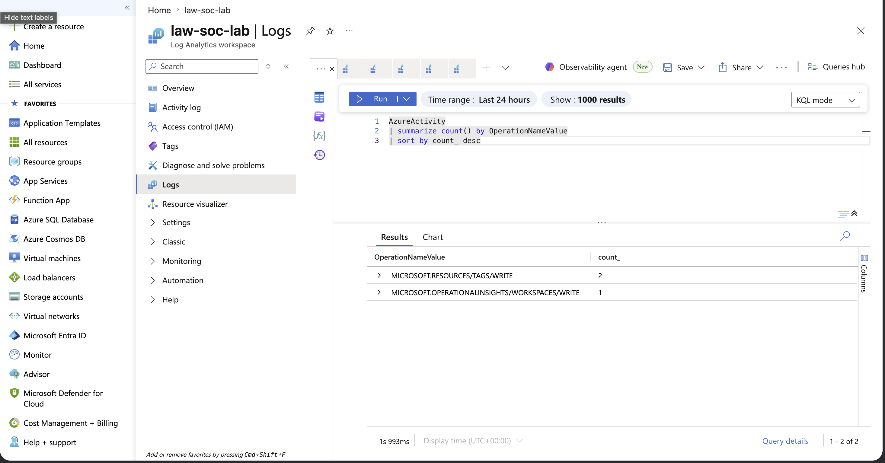
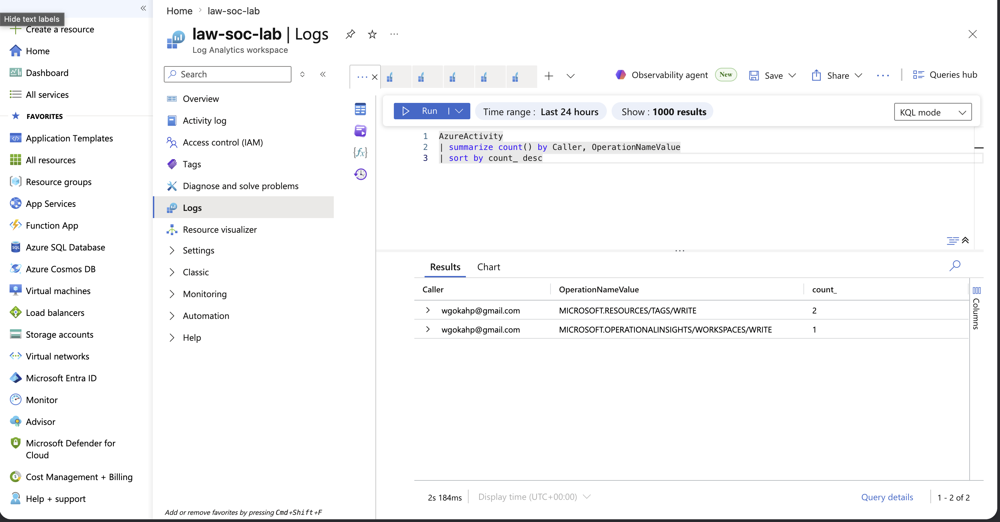

# KQL Fundamentals

Five operators turn a table of raw telemetry into an answer: filter, shape, aggregate, attribute, rank. This day drills them against live AzureActivity data rather than textbook samples, and ends on the one pivot, grouping by Caller, that the brute-force hunt two days later is built on.

## At a Glance

| Field | Detail |
| --- | --- |
| Stage | Day 3 of 7, query fluency |
| Goal | Core KQL operators on real ingested telemetry |
| Data | Live AzureActivity events |
| Model | Table → where → project → summarize → sort |
| Key Pivot | summarize by Caller, the basis for later attribution |
| Gotcha | Start/Success pairs double counts; auto-column is `count_` |

## What This Is

Turning ingested logs into answers using KQL, running the core operators against live AzureActivity data to filter, shape, aggregate, and attribute real telemetry.

The objective is query fluency, the day-to-day skill of a SOC analyst, built on real ingested events rather than clean textbook data. Real telemetry has quirks textbook data does not, and learning on the real thing is what makes the quirks familiar before they matter in a hunt.

## The Funnel Model

KQL works like a funnel: start with the whole table, then narrow step by step until only the events that matter remain.

`Table -> where (filter rows) -> project (pick columns) -> summarize (aggregate) -> sort (rank)`

## Investigation Methodology

Sampled the raw table to see its shape and column count.

Used `project` to cut dozens of columns down to four: when, what, status, who.

Used `where` to keep only successful operations, filtering out Start events.

Used `summarize` to collapse every event into a ranked list of operations by count.

Pivoted `summarize` by Caller to attribute every action to an identity.

## SOC Observation

Three details separate a query that looks right from one that is right.

Azure logs many operations as a Start/Success pair, so counting raw events without accounting for this can double the numbers, a silent error that inflates every total until someone filters on status. The auto-generated count column is named `count_` with a trailing underscore, which trips up every downstream reference that omits it. And `where` filters rows while `project` filters columns; they chain filter-first, then shape.

The `by Caller` pivot is the one to remember. Attributing every action to an identity is the backbone of the brute-force detection built on Day 5, where the question becomes not "how many failed logins" but "how many from one source against one account." Attribution is what turns a count into an incident.

## Core Operators

| Operator | What it does |
| --- | --- |
| where | Keeps only rows matching a condition |
| project | Keeps only the columns you name |
| summarize | Groups rows and aggregates |
| sort | Orders results |
| count / take | Counts rows / samples N rows |

## Learning Outcome

Demonstrated the ability to query a live SIEM with KQL, filtering, shaping, aggregating, and attributing real telemetry.

## Next

Day 4: turn these queries into a scheduled detection that fires incidents automatically.
