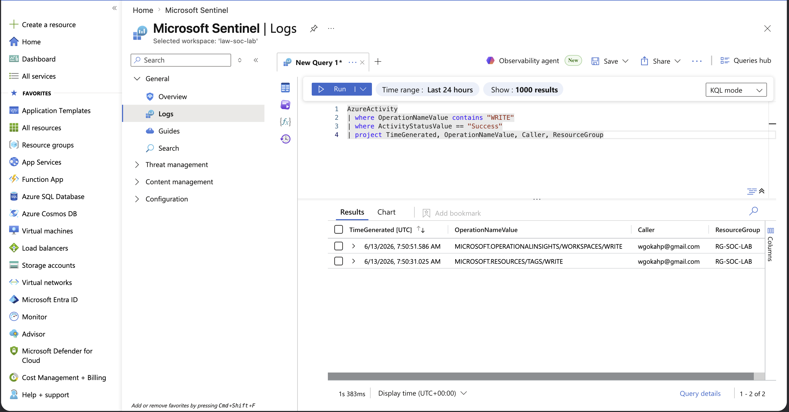
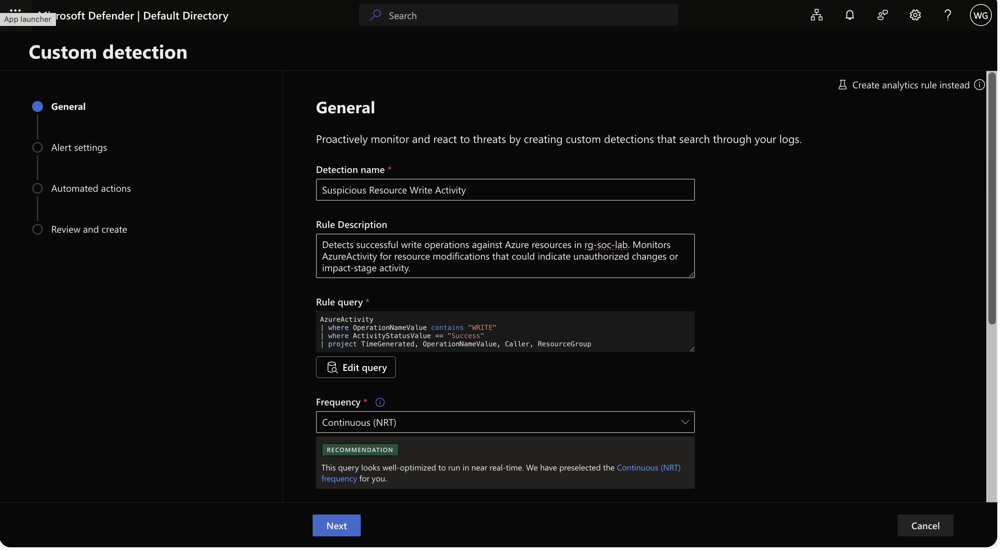
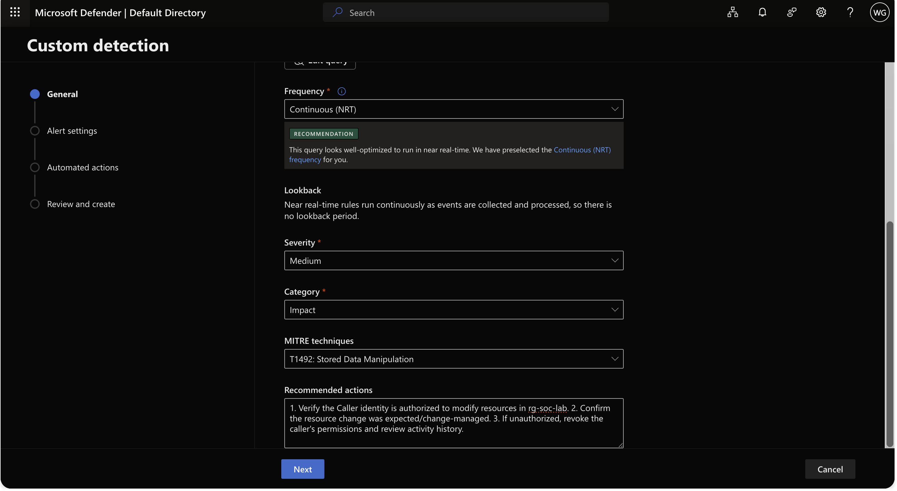
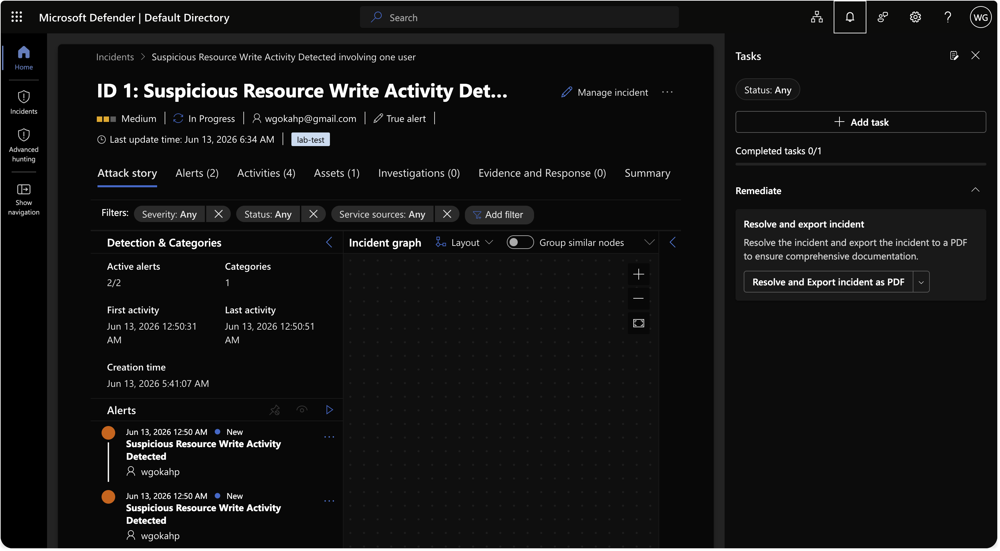

# Scheduled Analytics Rule & Incident Triage

## Incident Summary
Built a custom detection rule ("Suspicious Resource Write Activity") in Microsoft Sentinel via the unified Defender portal to detect successful write operations against Azure resources, triggered it with a controlled tag write, and triaged the resulting incident end to end as a Tier 1 analyst.

## Objective
Cross from interactive querying to operational detection: logic that runs automatically, raises alerts, correlates them into incidents, and surfaces them for triage.

## Affected System
- Log Analytics Workspace: law-soc-lab
- Data source: AzureActivity
- Caller / impacted identity: wgokahp@gmail.com

## Investigation Methodology

Validated the detection query in Logs, confirming successful WRITE events were returned.



```kql
AzureActivity
| where OperationNameValue contains "WRITE"
| where ActivityStatusValue == "Success"
| project TimeGenerated, OperationNameValue, Caller, ResourceGroup
```

Created the custom detection rule and configured its query and logic.



Set severity, MITRE category and technique, and recommended actions.



Saved the rule and confirmed it Enabled.


Triggered the rule with a tag write, then triaged the incident: took ownership, set status, classified as true positive.



## MITRE ATT&CK
| Tactic | Technique | ID |
|--------|-----------|----|
| Impact | Data Manipulation: Stored Data Manipulation | T1565.001 |

## SOC Observation
Microsoft has moved Sentinel's analytics rules into the unified Defender portal as "custom detection rules." The classic frequency-plus-lookback pairing is replaced by a single frequency control — near-real-time rules carry no lookback period which removes the old "lookback must be greater than or equal to frequency" trap. Entity correlation quality depends on matching the identifier type to the data: the Caller value is email-formatted, so UPN was the correct mapping.

## Learning Outcome
Built and operated a complete detection lifecycle: query validation, scheduled rule, alert enrichment, entity mapping, incident generation, and Tier 1 triage.

## Next
Day 5: simulate a real attack and hunt it down.
