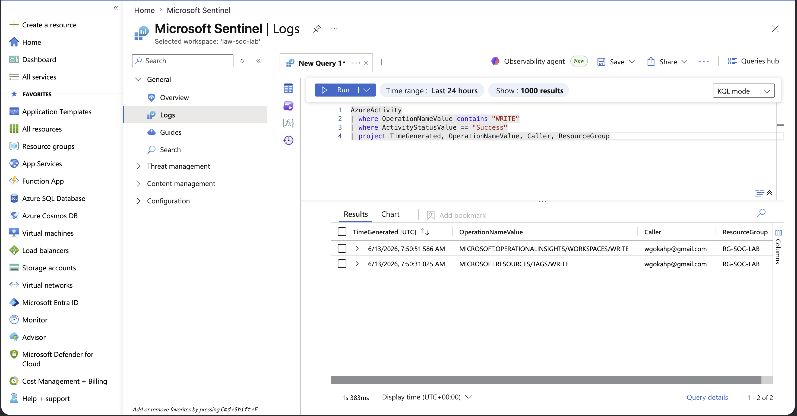
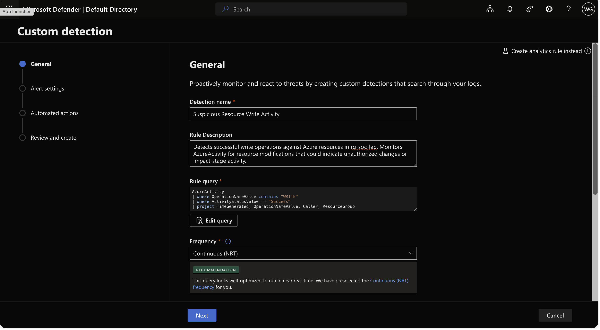
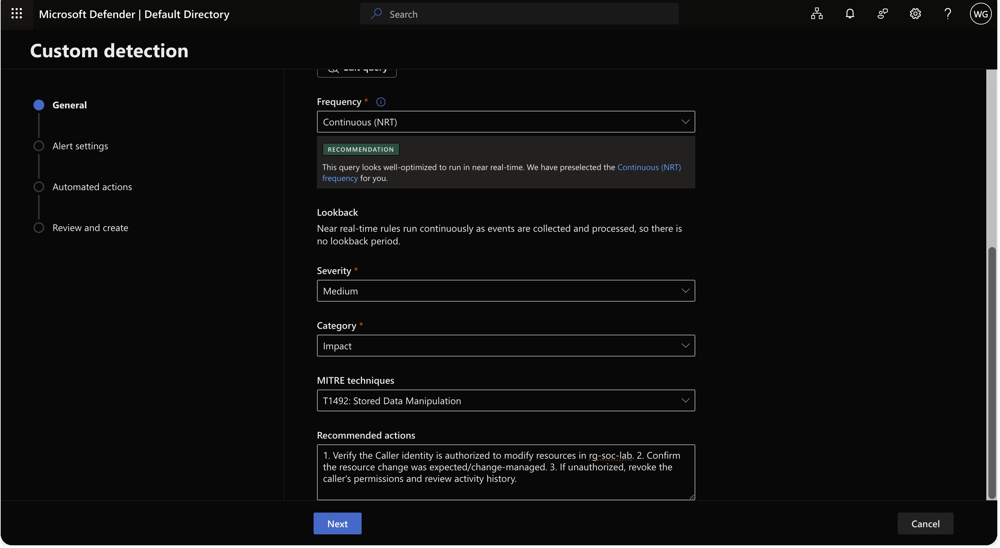
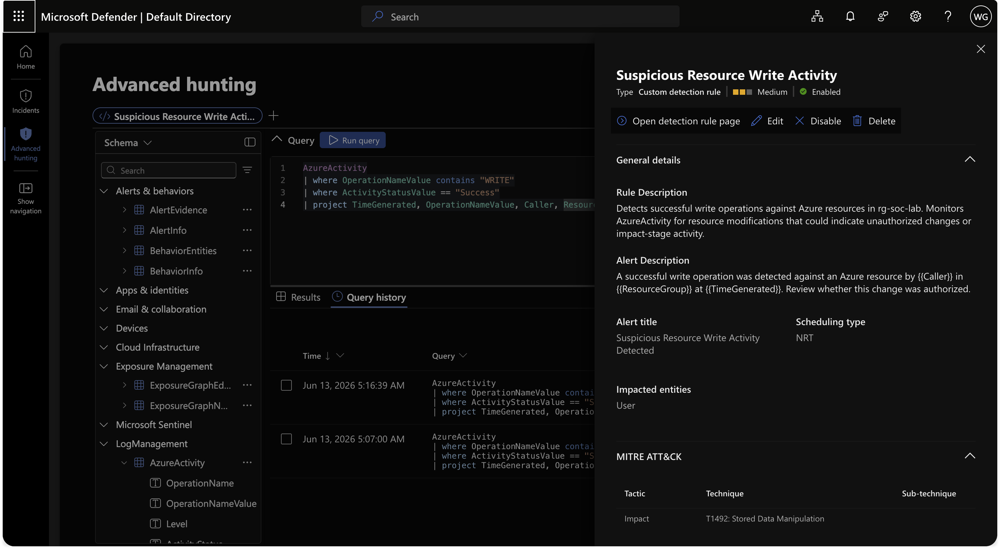
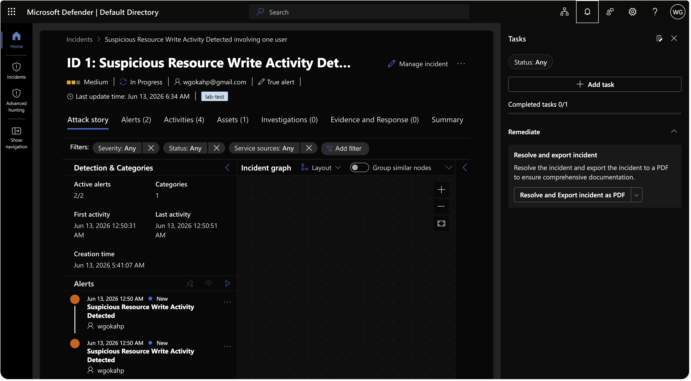

# Scheduled Analytics Rule & Incident Triage

The crossing point: from running queries by hand to detection logic that runs itself, raises an alert, correlates it into an incident, and surfaces it for triage. This day builds a custom detection rule, fires it with a controlled write, and works the resulting incident end to end as a Tier 1 analyst.

## At a Glance

| Field | Detail |
| --- | --- |
| Stage | Day 4 of 7, automation |
| Goal | Query becomes a self-firing detection and incident |
| Rule | Suspicious Resource Write Activity |
| Data source | AzureActivity |
| Trigger | Controlled tag write, classified true positive |
| MITRE | T1565.001 |
| Portal note | Built as a Defender-portal custom detection rule |

## What This Is

A custom detection rule ("Suspicious Resource Write Activity") built in Microsoft Sentinel via the unified Defender portal to detect successful write operations against Azure resources, triggered with a controlled tag write, and triaged end to end.

The objective is the crossing from interactive querying to operational detection: logic that runs automatically, raises alerts, correlates them into incidents, and surfaces them for triage. Days 1 through 3 proved you can ask the question; this day makes the question ask itself on a schedule.

## Affected System

- Log Analytics Workspace: `law-soc-lab`
- Data source: AzureActivity
- Caller / impacted identity: wgokahp@gmail.com

## Investigation Methodology

Validated the detection query in Logs, confirming successful WRITE events were returned.



```kql
AzureActivity
| where OperationNameValue contains "WRITE"
| where ActivityStatusValue == "Success"
| project TimeGenerated, OperationNameValue, Caller, ResourceGroup
```

Created the custom detection rule and configured its query and logic.



Set severity, MITRE category and technique, and recommended actions.



Saved the rule and confirmed it Enabled.



Triggered the rule with a tag write, then triaged the incident: took ownership, set status, classified as true positive.



## MITRE ATT&CK

| Tactic | Technique | ID |
| --- | --- | --- |
| Impact | Data Manipulation: Stored Data Manipulation | T1565.001 |

## SOC Observation

Two things about building detection in the current Sentinel matter here.

Microsoft has moved Sentinel's analytics rules into the unified Defender portal as "custom detection rules." The classic frequency-plus-lookback pairing is replaced by a single frequency control, near-real-time rules carry no lookback period, which removes the old "lookback must be greater than or equal to frequency" trap that snagged so many first rules. Documenting the current behavior rather than the tutorial-era behavior is the difference between a rule that deploys and one that errors.

Entity correlation quality depends on matching the identifier type to the data. The Caller value is email-formatted, so UPN was the correct mapping. Get that wrong and the incident still fires, but the entity graph is empty, and an incident with no entities is an alert an analyst cannot pivot from.

## Learning Outcome

Built and operated a complete detection lifecycle: query validation, scheduled rule, alert enrichment, entity mapping, incident generation, and Tier 1 triage.

## Next

Day 5: simulate a real attack and hunt it down.
