# Day 5 — SSH Brute-Force Detection & Compromise Confirmation

## Incident Summary
- **Incident Type:** Credential Access via SSH Brute-Force (Successful Compromise)
- **Severity:** High (confirmed account compromise — valid credentials obtained)
- **Detection Method:** Threat hunt across Linux Syslog (auth/authpriv) in Microsoft Sentinel
- **Data Pipeline:** Ubuntu auth.log → Azure Monitor Agent → Data Collection Rule → Sentinel (law-soc-lab)
- **Tools:** Hydra (attack), Azure Arc, Azure Monitor Agent, Microsoft Sentinel, KQL
- **Status:** Detected, confirmed, and contained

## Executive Summary
An automated SSH brute-force attack was launched from a single host against a monitored Linux server, targeting the account "mary". Across the campaign, 88 failed authentication attempts and 8 successful logins originated from the same source IP, confirming a credential compromise rather than a blocked attack. The activity was detected by hunting the Linux Syslog auth facility in Sentinel, confirmed by correlating failure and success counts per source, and contained by blocking the source IP at the host firewall.

## Affected System
- **Target Host:** monitored Ubuntu Linux server
- **Targeted Account:** mary
- **Exposed Service:** OpenSSH (TCP/22)
- **Source IP:** 192.168.64.15
- **Monitoring:** Azure Monitor Agent forwarding auth/authpriv syslog to law-soc-lab

## Investigation Methodology

A baseline check of identity sign-in logs returned no results, confirming the hunt had to run against host-level Linux authentication logs.

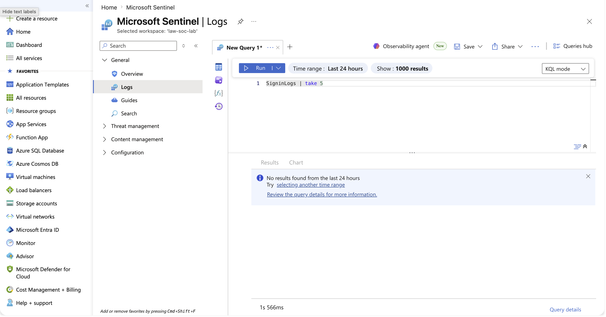

The Linux target was onboarded to Azure Arc.

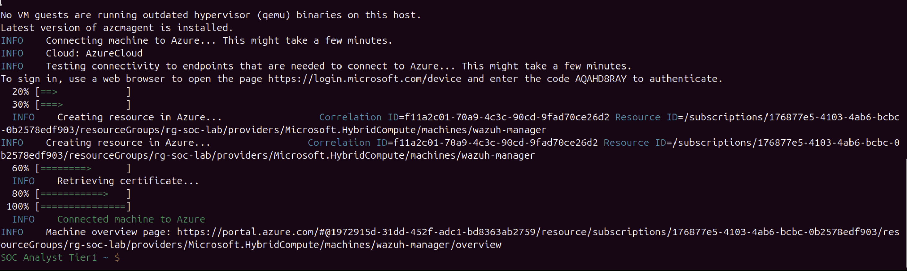

The Azure Monitor Agent was deployed to the Arc-connected machine.

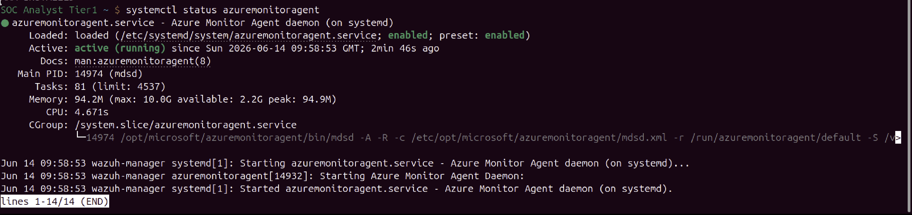

A baseline query verified auth/authpriv syslog events were flowing into the workspace before any attack.

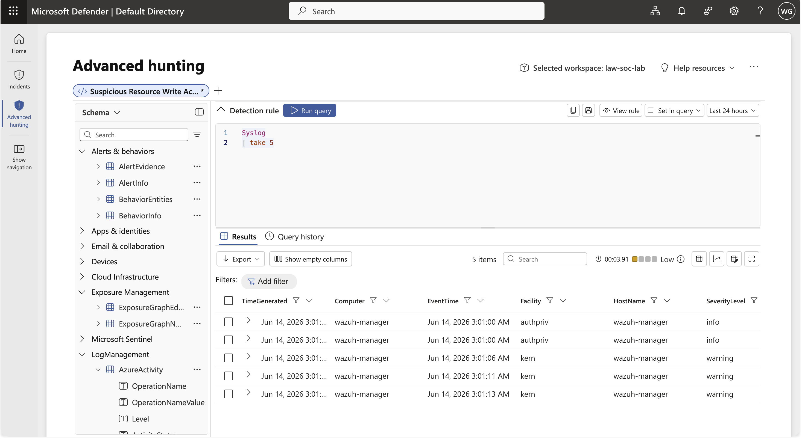

A controlled brute-force was executed from the attacker host using Hydra against SSH.

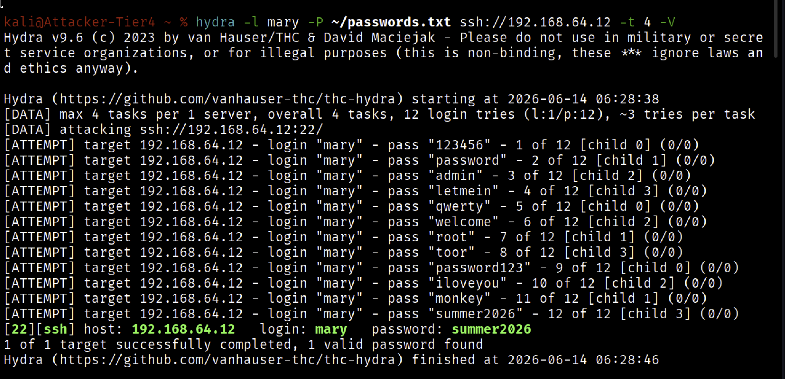

The resulting events were confirmed in the Sentinel Syslog table.

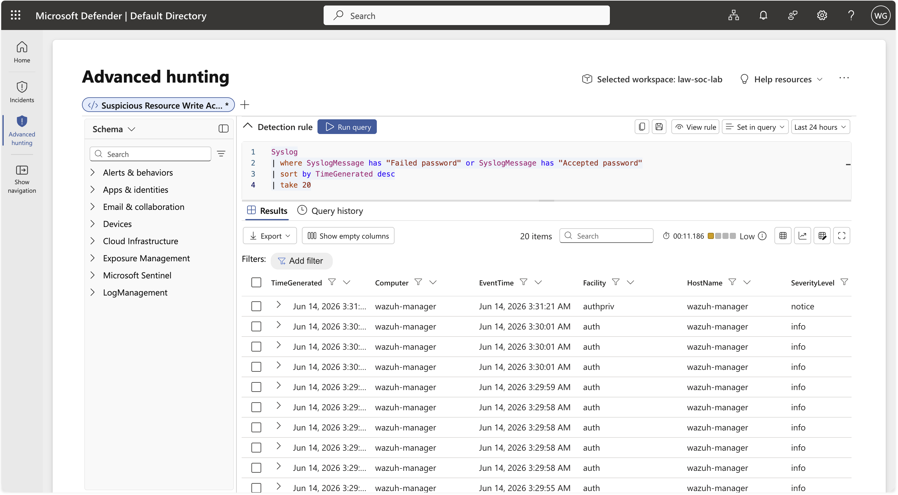

## SOC Analyst Findings

Aggregating failed SSH authentications by source IP and user surfaced a single source (192.168.64.15) responsible for 88 failed logins against mary — the defining signature of password-guessing.

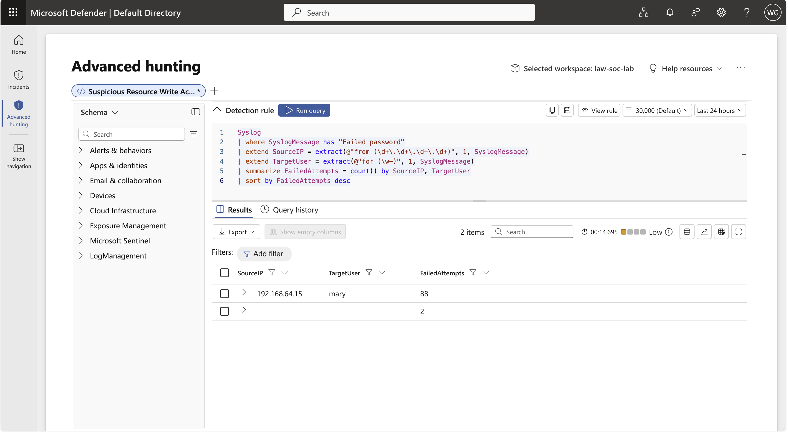

Correlating failures with successes per source showed the same IP with 88 failures and 8 successful logins, elevating this from an attempted attack to a confirmed compromise.

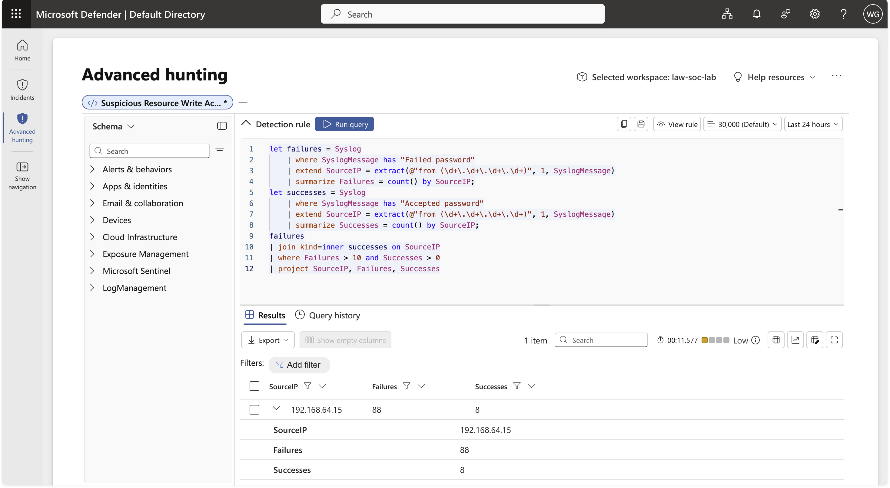

A chronological timeline showed the activity compressed into roughly 75 seconds, consistent with an automated tool.

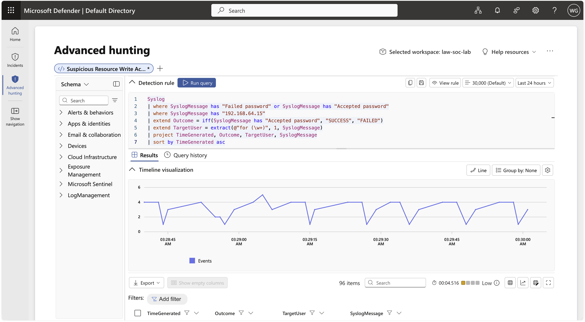

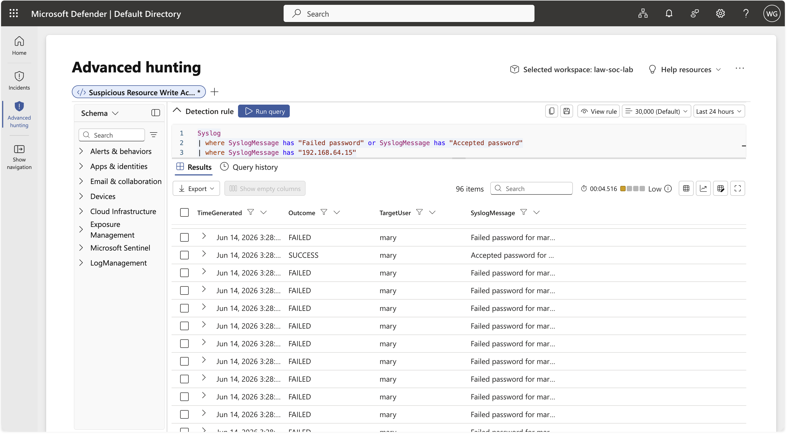

## Indicators of Compromise (IOCs)
| Indicator | Type | Value |
|-----------|------|-------|
| Source IP | IPv4 | 192.168.64.15 |
| Targeted account | Username | mary |
| Target service | Port | TCP/22 (SSH) |
| Failed authentications | Count | 88 |
| Successful authentications | Count | 8 |

## MITRE ATT&CK
| Tactic | Technique | ID |
|--------|-----------|----|
| Credential Access | Brute Force: Password Guessing | T1110.001 |
| Credential Access | Brute Force | T1110 |
| Initial Access | Valid Accounts | T1078 |

## SOC Analyst Response
Upon confirming the compromise, the attacker source IP was contained at the host firewall — a UFW deny rule for 192.168.64.15 inserted above the permissive SSH rule, cutting off all further access.

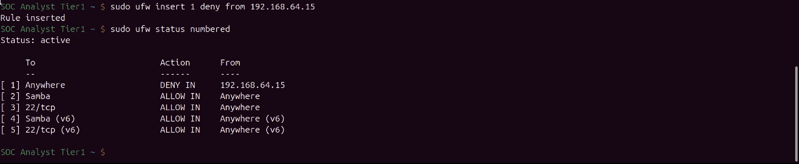

Recommended follow-up: reset the compromised account credentials, review for post-compromise activity, and enforce key-based authentication, fail2ban, and SSH source restrictions.

## Analyst Insight
The decisive step was not detecting failed logins in isolation but correlating failures with successes from the same source. A high failure count alone indicates an attempted attack; failures paired with successes indicate the attacker broke through. That distinction separates routine noise from an escalation-worthy incident.

## Learning Outcome
Exercised the full incident lifecycle on a self-built telemetry pipeline: Arc onboarding, AMA deployment, DCR scoping, KQL hunting, compromise confirmation, and containment — the detect, confirm, contain sequence of Tier 1 SOC work.

## Next
Day 6: hunt malicious PowerShell on a Windows endpoint — a different log source and tactic.
