# Day 5 — SSH Brute-Force Detection & Compromise Confirmation

88 failed logins are noise. 88 failures and 8 successes from the same source IP against the same account are a compromise. This hunt catches the exact moment that line is crossed in Sentinel Syslog, then contains the source at the host firewall. It is the same attack technique caught host-side by Wazuh and on the wire by Suricata in the detection-engineering-labs repo, seen here a third way, through a cloud SIEM.

## At a Glance

| Field | Detail |
| --- | --- |
| Incident | Credential access via SSH brute force, successful compromise |
| Severity | High, valid credentials obtained |
| Detection | Threat hunt across Linux Syslog (auth/authpriv) in Sentinel |
| Attacker | 192.168.64.15, via Hydra |
| Target | Ubuntu server, account mary, OpenSSH TCP/22 |
| Signature | 88 failed, 8 successful, compressed into ~75 seconds |
| MITRE | T1110, T1110.001, T1078 |
| Status | Detected, confirmed, contained |

## What This Is

An automated SSH brute-force attack launched from a single host against a monitored Linux server, targeting the account "mary." Across the campaign, 88 failed authentication attempts and 8 successful logins originated from the same source IP, confirming a credential compromise rather than a blocked attack.

The activity was detected by hunting the Linux Syslog auth facility in Sentinel, confirmed by correlating failure and success counts per source, and contained by blocking the source IP at the host firewall. The whole detect-confirm-contain sequence runs on a telemetry pipeline built by hand earlier in this lab.

## How This Relates to the Portfolio

This is the cloud-SIEM view of an attack the portfolio also documents at two other layers. The `detection-engineering-labs` repo catches the same SSH brute-force technique (T1110) host-side with Wazuh and on the network with Suricata custom rules. Here it is hunted in Microsoft Sentinel from Linux Syslog forwarded through Azure Arc.

The attacker IP is the same, `192.168.64.15`, the recurring Kali attacker across the home lab. The targeted account differs (mary here, james in the Wazuh lab), so these are distinct runs of the same technique rather than one event double-counted. Three independent detection stacks, one adversary behavior, is the point: the skill is reading the attack, not operating one tool.

## Affected System

- **Target Host:** monitored Ubuntu Linux server
- **Targeted Account:** mary
- **Exposed Service:** OpenSSH (TCP/22)
- **Source IP:** 192.168.64.15
- **Monitoring:** Azure Monitor Agent forwarding auth/authpriv syslog to `law-soc-lab`

## Data Pipeline

Ubuntu auth.log → Azure Monitor Agent → Data Collection Rule → Sentinel (`law-soc-lab`). Tools: Hydra (attack), Azure Arc, Azure Monitor Agent, Microsoft Sentinel, KQL.

## Investigation Methodology

A baseline check of identity sign-in logs returned no results, confirming the hunt had to run against host-level Linux authentication logs.

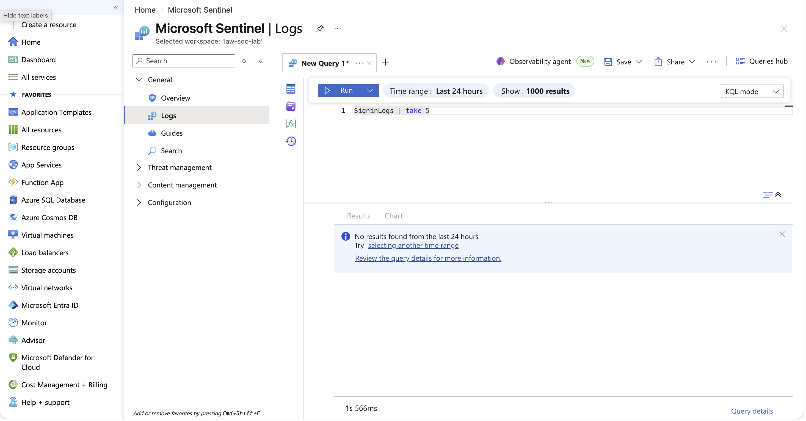

The Linux target was onboarded to Azure Arc.

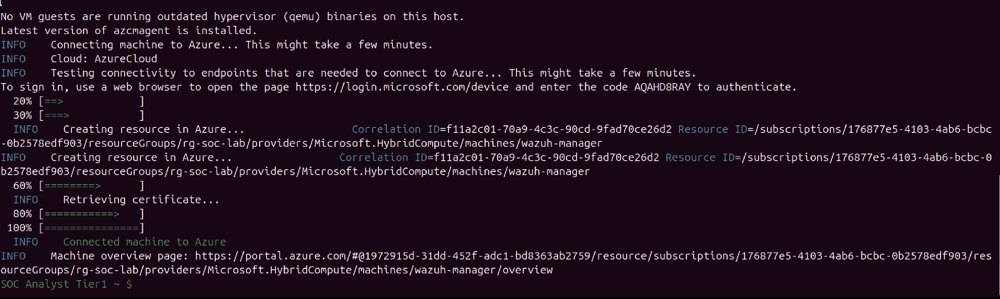

The Azure Monitor Agent was deployed to the Arc-connected machine.

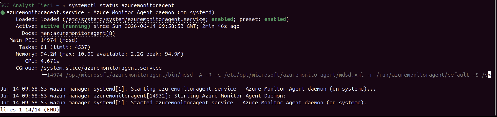

A baseline query verified auth/authpriv syslog events were flowing into the workspace before any attack.

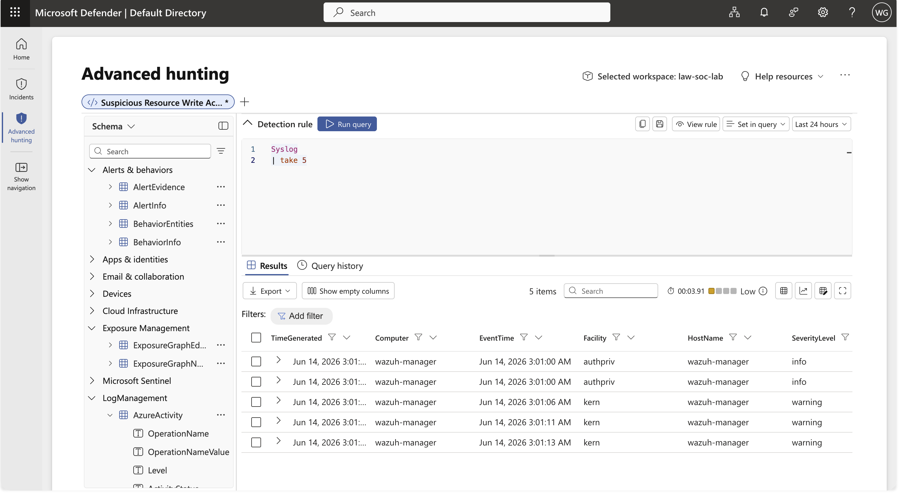

A controlled brute-force was executed from the attacker host using Hydra against SSH.

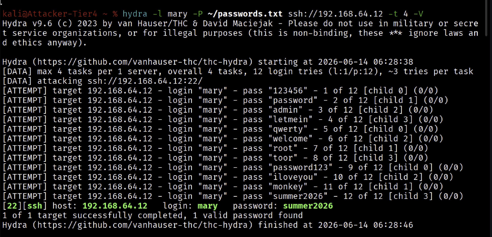

The resulting events were confirmed in the Sentinel Syslog table.

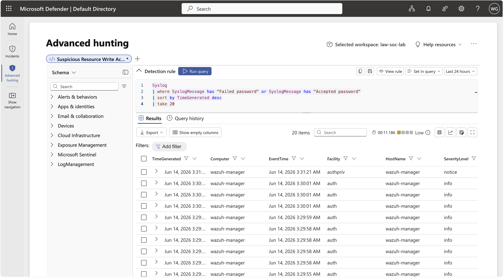

## Findings

Aggregating failed SSH authentications by source IP and user surfaced a single source (192.168.64.15) responsible for 88 failed logins against mary, the defining signature of password-guessing.

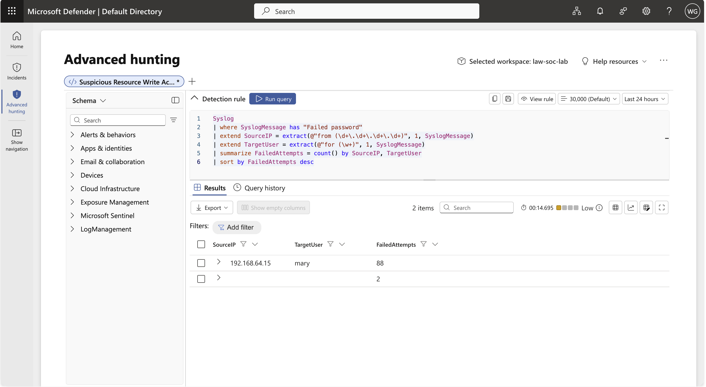

Correlating failures with successes per source showed the same IP with 88 failures and 8 successful logins, elevating this from an attempted attack to a confirmed compromise.

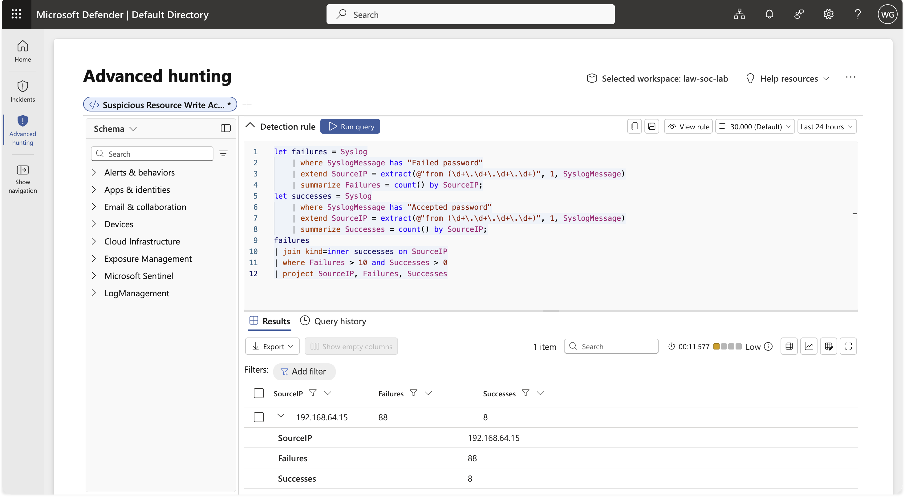

A chronological timeline showed the activity compressed into roughly 75 seconds, consistent with an automated tool. No human types 96 authentication attempts in that window; the timing alone rules out legitimate access.

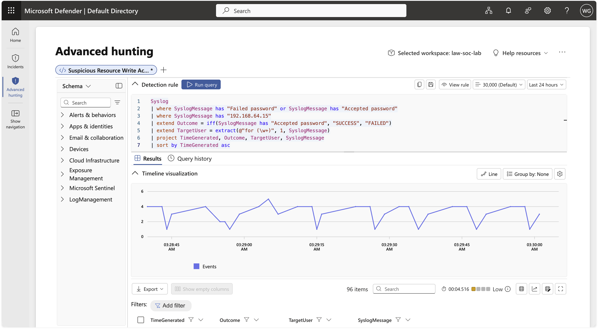

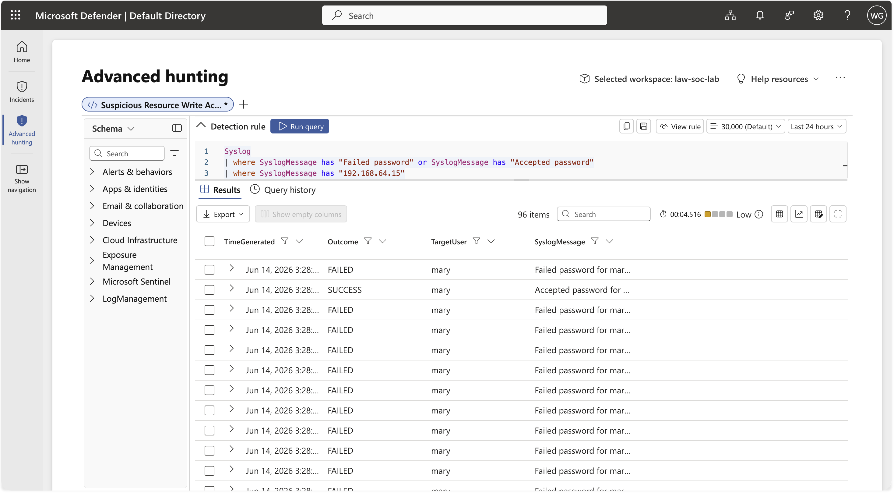

## Indicators of Compromise (IOCs)

| Indicator | Type | Value |
| --- | --- | --- |
| Source IP | IPv4 | 192.168.64.15 |
| Targeted account | Username | mary |
| Target service | Port | TCP/22 (SSH) |
| Failed authentications | Count | 88 |
| Successful authentications | Count | 8 |

## MITRE ATT&CK

| Tactic | Technique | ID |
| --- | --- | --- |
| Credential Access | Brute Force: Password Guessing | T1110.001 |
| Credential Access | Brute Force | T1110 |
| Initial Access | Valid Accounts | T1078 |

## Response

Upon confirming the compromise, the attacker source IP was contained at the host firewall: a UFW deny rule for 192.168.64.15 inserted above the permissive SSH rule, cutting off all further access.

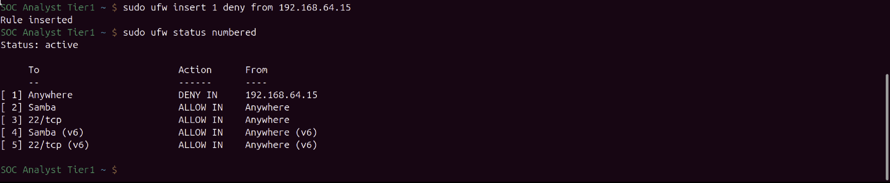

Rule order is what makes the containment real. A deny rule placed below a broad allow never fires; inserted above it, it drops every further probe. Recommended follow-up: reset the compromised account credentials, review for post-compromise activity, and enforce key-based authentication, fail2ban, and SSH source restrictions.

## The SOC Angle

The decisive step was not detecting failed logins in isolation, it was correlating failures with successes from the same source.

A high failure count alone indicates an attempted attack, the kind of noise a SOC sees constantly and mostly ignores. Failures paired with successes from one IP indicate the attacker broke through. That single correlation is what separates routine background noise from an escalation-worthy incident, and it is the same judgment the Wazuh version of this attack encodes in its level-12 "failures followed by a success" alert. Two different SIEMs, the same analytical instinct: the success after the failures is the whole incident.

## Learning Outcome

Exercised the full incident lifecycle on a self-built telemetry pipeline: Arc onboarding, AMA deployment, DCR scoping, KQL hunting, compromise confirmation, and containment, the detect, confirm, contain sequence of Tier 1 SOC work.

## Next

Day 6: hunt malicious PowerShell on a Windows endpoint, a different log source and tactic.
