# Malicious PowerShell Execution Hunt on Windows Endpoint

## Incident Summary
| Field | Detail |
|-------|--------|
| Incident Type | Malicious PowerShell Execution (obfuscated payload, download cradle, policy bypass) |
| Severity | High |
| Detection Method | PowerShell Script Block Logging (Event ID 4104) via Azure Monitor Agent → Microsoft Sentinel |
| Affected Host | JAMES-VM (Windows 11) |
| Tools | Azure Arc, Azure Monitor Agent, Data Collection Rule, Microsoft Sentinel, KQL |
| MITRE Techniques | T1059.001, T1105 |
| Status | Closed True Positive (simulated) |

## Executive Summary
A Windows 11 endpoint was onboarded into Microsoft Sentinel to hunt for malicious PowerShell execution. During pipeline validation a platform constraint was identified: the SecurityEvent table (Event ID 4688, process creation) did not populate on this tenant, while the Event table carrying PowerShell Script Block Logging (Event ID 4104) ingested normally. The hunt was pivoted entirely onto 4104 telemetry, which proved sufficient to detect every simulated technique including a base64-encoded command, demonstrating that script block logging records the decoded payload regardless of obfuscation.

## Affected System
| Attribute | Value |
|-----------|-------|
| Hostname | JAMES-VM |
| Operating System | Windows 11 |
| Onboarding | Azure Arc → Azure Monitor Agent → Data Collection Rule |
| Log Source | Microsoft-Windows-PowerShell/Operational (Event ID 4104) |
| Destination | Log Analytics Workspace law-soc-lab |

## Investigation Methodology

### Step 1 Baseline the Windows event tables
Both SecurityEvent and Event (4104) returned zero rows, confirming ingestion had to be built.

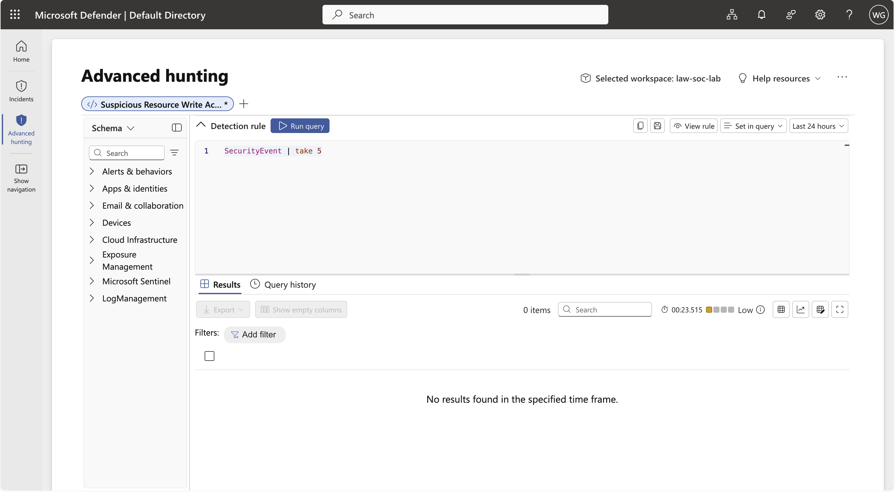
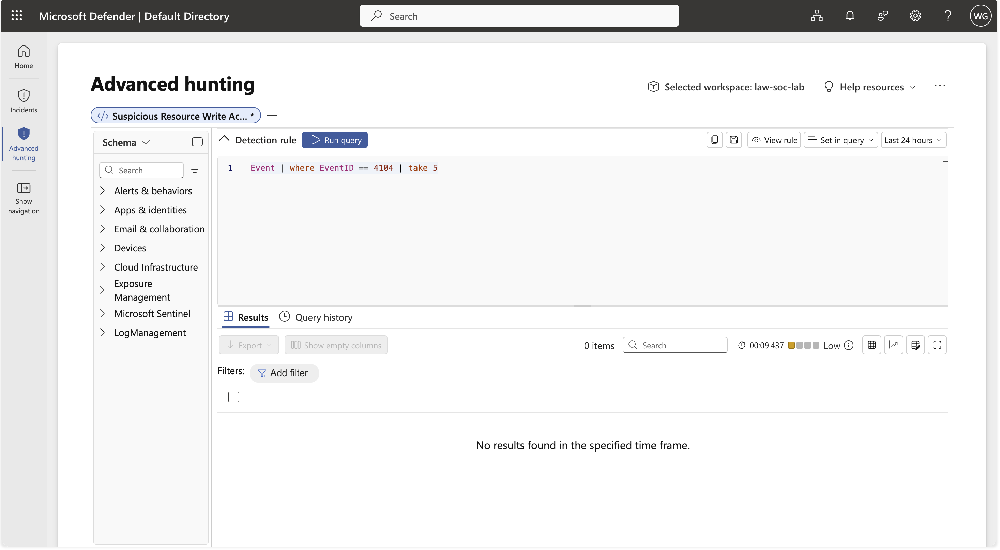

### Step 2 Onboard via Azure Arc and deploy the Azure Monitor Agent
The Windows VM was onboarded to Azure Arc and a Data Collection Rule was associated, deploying the agent.

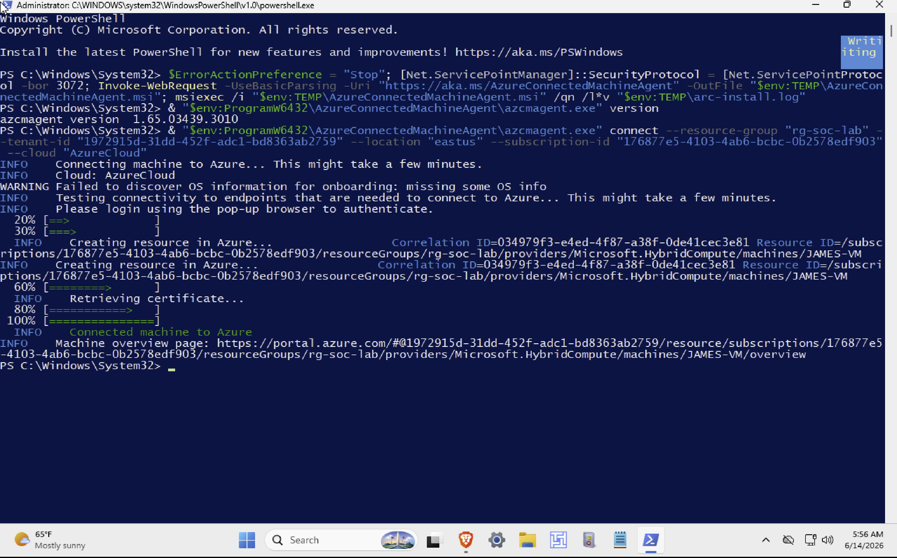
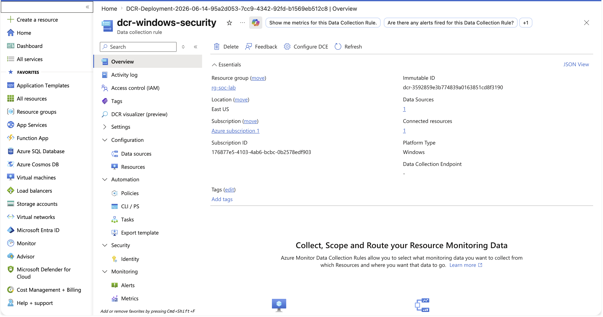

The DCR used custom XPath queries to collect exactly the required event IDs.

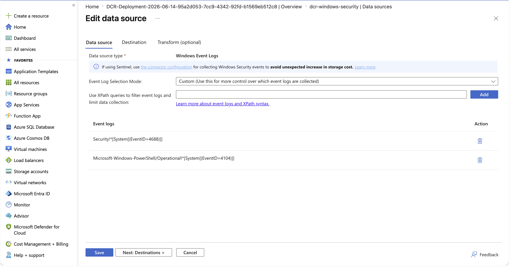

### Step 3 Enable host-side logging
Audit process creation, command-line inclusion, and PowerShell script block logging were enabled on the endpoint.

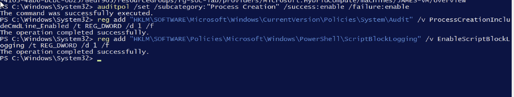

### Step 4 Simulate malicious PowerShell
Three execution techniques were run on the endpoint (benign payloads, harmless target).

Encoded command (obfuscation):

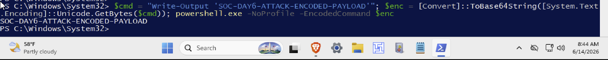

Hidden download cradle:


Execution-policy bypass:

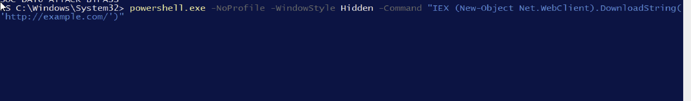

### Step 5 Hunt the telemetry

Suspicious script block indicators:

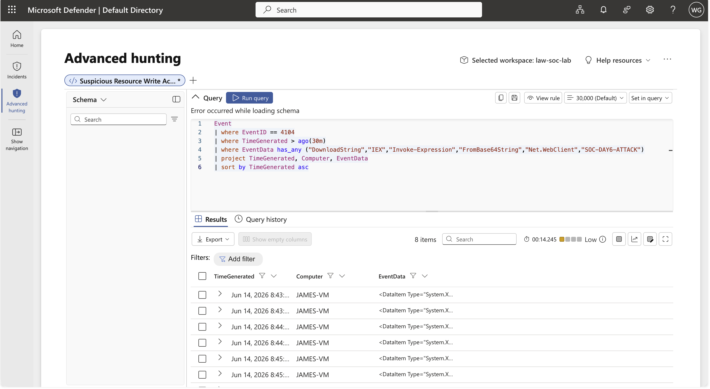

```kql
Event
| where EventID == 4104
| where EventData has_any ("DownloadString","IEX","Invoke-Expression","FromBase64String","Net.WebClient","SOC-DAY6-ATTACK")
| project TimeGenerated, Computer, EventData
| sort by TimeGenerated asc
```

Obfuscation defeated the base64-encoded payload recovered in decoded form:

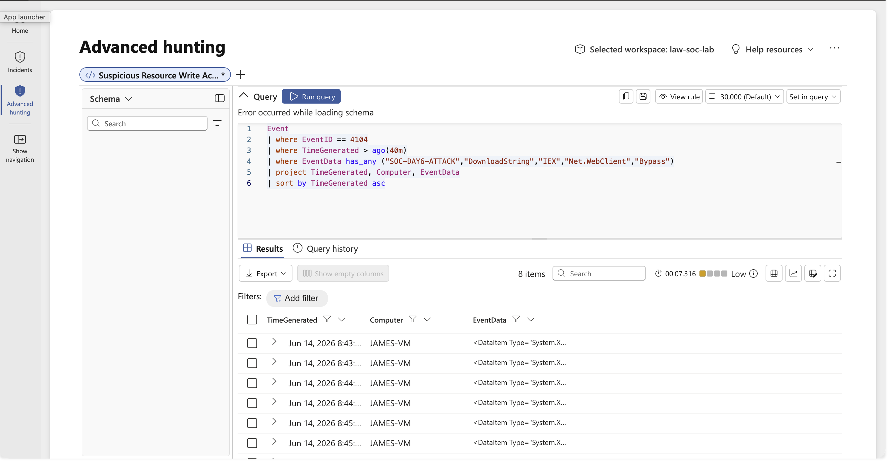

Execution timeline:

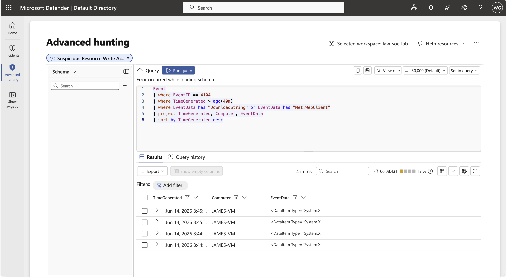

## Indicators of Compromise (IOCs)
| Type | Indicator |
|------|-----------|
| Process | powershell.exe with -EncodedCommand |
| Behaviour | IEX (New-Object Net.WebClient).DownloadString(...) download cradle |
| Flag | -WindowStyle Hidden (window-hiding evasion) |
| Flag | -ExecutionPolicy Bypass |
| Host | JAMES-VM |

## MITRE ATT&CK
| Tactic | Technique | ID |
|--------|-----------|----|
| Execution | Command and Scripting Interpreter: PowerShell | T1059.001 |
| Command and Control | Ingress Tool Transfer | T1105 |

## SOC Analyst Findings
- All three simulated PowerShell execution techniques were detected via Event ID 4104.
- The base64-encoded command was recovered in decoded form, defeating obfuscation.
- A telemetry gap was identified: SecurityEvent (4688) is not collected on this tenant; Event (4104) is.
- Hidden-window execution did not evade script block logging.

## Analyst Insight
The most valuable lesson was the adaptation. When the expected process-creation telemetry proved unavailable, the hunt pivoted to PowerShell Script Block Logging which turned out to be the stronger source, because it records the decoded content of obfuscated commands that 4688 alone would only show as an opaque encoded blob. Real detection work is rarely a clean run against ideal telemetry; the analyst's job is to detect with the data that is actually flowing.

## Learning Outcome
- Onboarded a Windows endpoint to Sentinel via Azure Arc → AMA → DCR.
- Configured custom XPath event collection for specific Windows Event IDs.
- Enabled audit process creation, command-line inclusion, and script block logging.
- Distinguished the gated SecurityEvent table from the ungated Event table.
- Proved script block logging defeats -EncodedCommand obfuscation.

## Conclusion
Day 6 established Windows PowerShell execution monitoring in Microsoft Sentinel and detected three obfuscation and evasion techniques using Event ID 4104, working around a tenant-level telemetry constraint by pivoting to script block logging. This investigation feeds the flagship report synthesizing the Linux brute-force (T1110) and Windows PowerShell (T1059.001) investigations.
